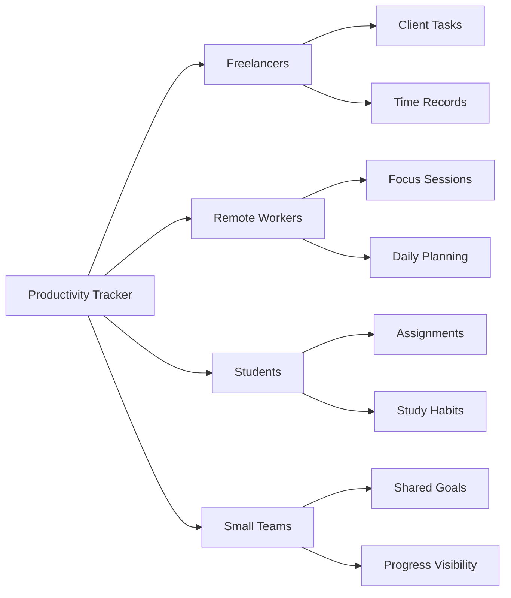
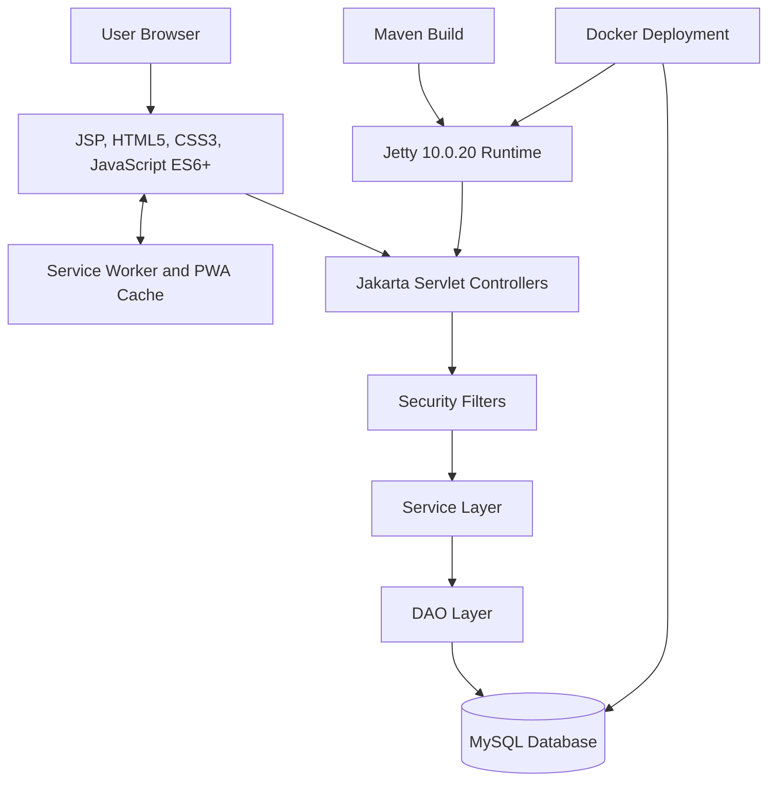
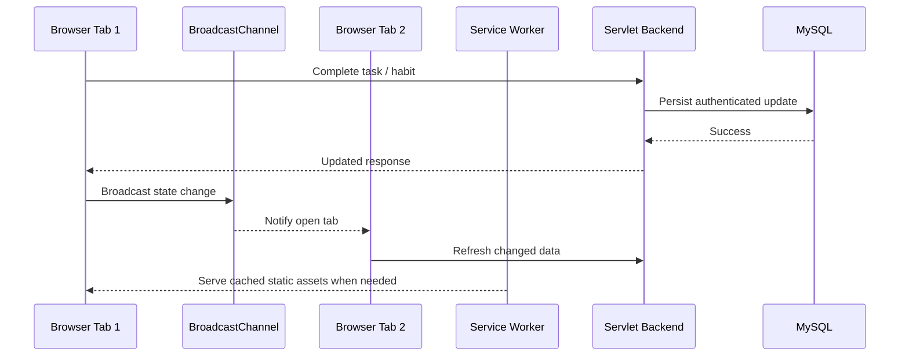
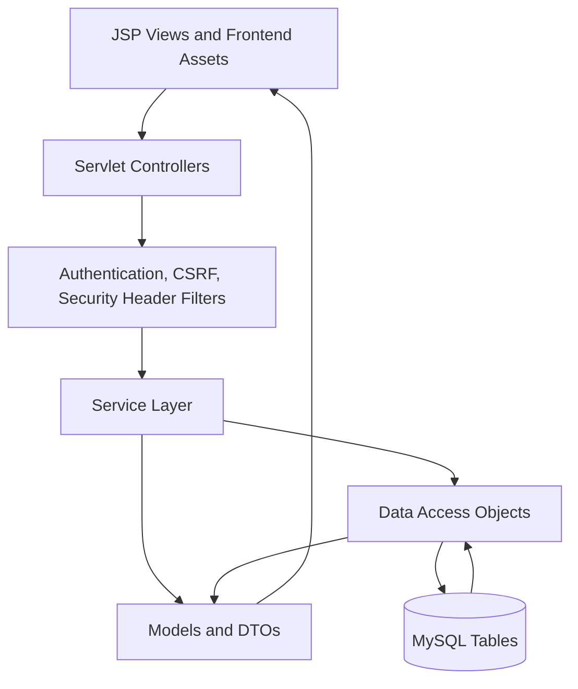
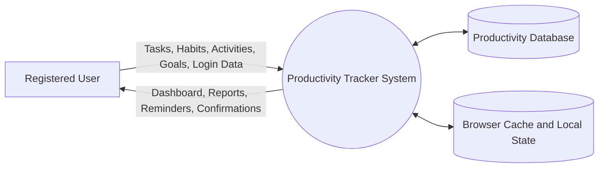
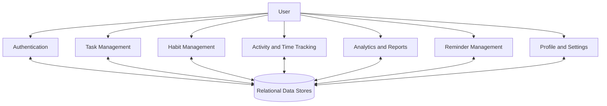
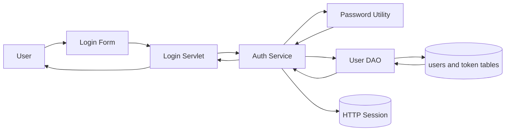
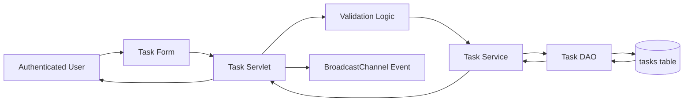
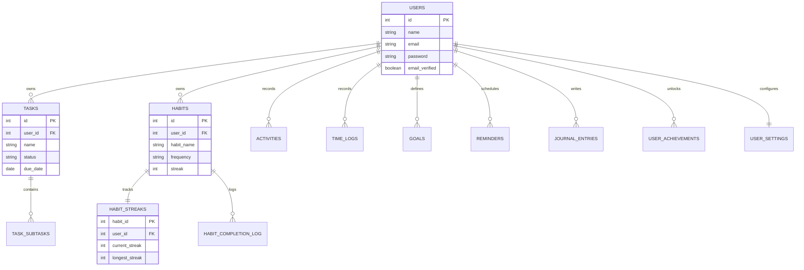
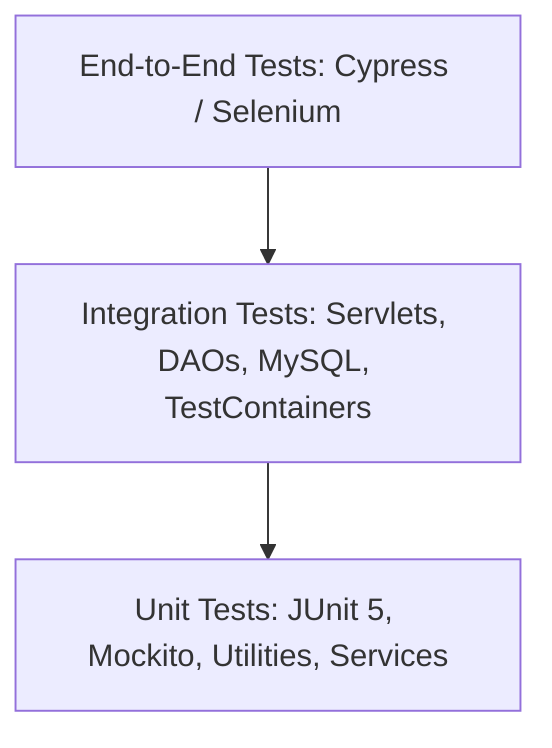

# MASTER OF COMPUTER APPLICATIONS PROJECT REPORT

## PRODUCTIVITY TRACKER

### A Comprehensive Web-Based Productivity Management and Analytics System

Submitted in partial fulfillment of the requirements for the award of the degree of

## Master of Computer Applications (MCA)

Submitted by:

**Mayank Chaubey**  
**Roll No.: [Insert Roll No]**

Under the guidance of:

**[Insert Guide Name]**

School of Computer Applications  
Manav Rachna International Institute of Research and Studies  
(Deemed to be University), Faridabad

**Academic Year: 2025-2026**  
**Date of Submission: [Insert Date]**

---

# Declaration

I, **Mayank Chaubey**, Roll No. **[Insert Roll No]**, student of Master of Computer Applications, School of Computer Applications, Manav Rachna International Institute of Research and Studies (Deemed to be University), Faridabad, hereby declare that the project report entitled **"Productivity Tracker"** is an original work carried out by me under the guidance of **[Insert Guide Name]**.

I further declare that this project report has not been submitted, either in full or in part, to any other university, institute, or organization for the award of any degree, diploma, fellowship, or similar academic recognition. The work presented in this report has been prepared for academic evaluation and reflects the analysis, design, implementation, testing, and documentation of the Productivity Tracker software application.

All references, technical documents, standards, software specifications, and online resources consulted during the preparation of this report have been duly acknowledged in the References section. Wherever external concepts, specifications, or standards have been discussed, appropriate academic attribution has been provided.

**Student Name:** Mayank Chaubey  
**Roll No.:** [Insert Roll No]  
**Signature:** _______________________  
**Date:** [Insert Date]

---

# Certificate from the Guide

This is to certify that the project report entitled **"Productivity Tracker"** submitted by **Mayank Chaubey**, Roll No. **[Insert Roll No]**, student of Master of Computer Applications, School of Computer Applications, Manav Rachna International Institute of Research and Studies (Deemed to be University), Faridabad, is a bonafide record of project work carried out under my supervision and guidance.

The project has been completed as part of the requirements for the award of the degree of Master of Computer Applications. The work demonstrates the application of software engineering principles, web application architecture, relational database design, security practices, and modern frontend development techniques in the development of an enterprise-grade productivity management system.

To the best of my knowledge, the work presented in this report is original and has not been submitted elsewhere for any academic award.

**Project Guide:** [Insert Guide Name]  
**Designation:** [Insert Designation]  
**School of Computer Applications**  
**Signature:** _______________________  
**Date:** [Insert Date]

---

# Acknowledgement

I express my sincere gratitude to **[Insert Guide Name]**, my project guide, for the continuous guidance, academic supervision, technical feedback, and encouragement provided throughout the development and documentation of the Productivity Tracker project. The direction received during requirement analysis, architectural planning, implementation review, and report preparation was valuable in shaping the project into a complete academic and technical submission.

I extend my respectful thanks to **Prof. (Dr.) Suhail Javed Quraishi**, Head of Department, for providing an academic environment that supports practical software development, research-oriented thinking, and disciplined project execution. I am also thankful to the Associate Dean and Dean of the institution for their administrative support, academic leadership, and encouragement toward industry-aligned software engineering practices.

I would also like to thank the Training and Placement Officer (TPO) for motivating students to build employability-oriented projects that reflect current technology trends and professional development standards. I am grateful to the faculty members of the School of Computer Applications for their suggestions, classroom learning, and evaluation inputs, which contributed directly and indirectly to the successful completion of this project.

Finally, I thank my classmates, friends, and family for their support during the project duration. Their encouragement, usability feedback, and patience helped in refining the user experience, testing the application workflows, and completing the report in a professional manner.

**Mayank Chaubey**

---

# List of Figures

| Figure No. | Title | Chapter |
|---|---|---|
| Figure 1.1 | Target User Groups for Productivity Tracker | Chapter 1 |
| Figure 2.1 | Proposed Productivity Tracker System Overview | Chapter 2 |
| Figure 2.2 | Offline and Multi-Tab Synchronization Model | Chapter 2 |
| Figure 4.1 | Sixteen-Week Gantt Chart for Project Development | Chapter 4 |
| Figure 4.2 | Risk Assessment Matrix | Chapter 4 |
| Figure 5.1 | MVC Layered Architecture of Productivity Tracker | Chapter 5 |
| Figure 5.2 | 0-Level Data Flow Diagram | Chapter 5 |
| Figure 5.3 | 1-Level Data Flow Diagram | Chapter 5 |
| Figure 5.4 | 2-Level DFD for Authentication Flow | Chapter 5 |
| Figure 5.5 | 2-Level DFD for Task Creation Flow | Chapter 5 |
| Figure 5.6 | Entity Relationship Diagram | Chapter 5 |
| Figure 5.7 | Login Page User Interface | Chapter 5 |
| Figure 5.8 | Registration Page User Interface | Chapter 5 |
| Figure 5.9 | Dashboard User Interface Layout | Chapter 5 |
| Figure 6.1 | Testing Pyramid Used in Productivity Tracker | Chapter 6 |
| Figure 7.1 | Productivity Dashboard Output | Chapter 7 |
| Figure 7.2 | Task Management Screen | Chapter 7 |
| Figure 7.3 | Habit Streak Tracking Interface | Chapter 7 |
| Figure 7.4 | Analytics and Reports Screen | Chapter 7 |
| Figure 7.5 | Focus Timer Screen | Chapter 7 |
| Figure 7.6 | Profile Management Screen | Chapter 7 |
| Figure 7.7 | Performance Metrics Summary | Chapter 7 |

---

# Professional Index

```text
PROJECT REPORT: PRODUCTIVITY TRACKER ........................................ 1
|
+-- FRONT MATTER ............................................................ 1
|   |
|   +-- Cover Page .......................................................... 1
|   +-- Declaration ......................................................... 2
|   +-- Certificate from the Guide .......................................... 3
|   +-- Acknowledgement ..................................................... 4
|   +-- List of Figures ..................................................... 5
|
+-- CHAPTER 1: INTRODUCTION ................................................. 6
|   |
|   +-- 1.1 About Organization (Target Users) ............................... 6
|   +-- 1.2 Manpower ........................................................ 8
|   +-- 1.3 Problem Statement ............................................... 10
|   +-- 1.4 Introduction to Project ......................................... 12
|   +-- 1.5 Project Category ................................................ 14
|   +-- 1.6 Aims & Objectives ............................................... 15
|       |
|       +-- 1.6.1 Primary Objectives ........................................ 16
|       +-- 1.6.2 Secondary Objectives ...................................... 18
|
+-- CHAPTER 2: SYSTEM STUDY ................................................ 20
|   |
|   +-- 2.1 Identification of Need .......................................... 20
|   +-- 2.2 Proposed System ................................................. 22
|   +-- 2.3 Unique Features of the System ................................... 24
|       |
|       +-- 2.3.1 Unique Features ........................................... 25
|       +-- 2.3.2 Impact of Unique Features ................................. 27
|
+-- CHAPTER 3: REQUIREMENT ANALYSIS & SYSTEM SPECIFICATION ................. 29
|   |
|   +-- 3.1 Feasibility Study ............................................... 29
|   |   |
|   |   +-- 3.1.1 Technical Feasibility ..................................... 31
|   |   +-- 3.1.2 Economic Feasibility ...................................... 33
|   |   +-- 3.1.3 Behavioral Feasibility .................................... 35
|   |   +-- 3.1.4 Legal and Regulatory Feasibility .......................... 37
|   |
|   +-- 3.2 SDLC Model ...................................................... 39
|   +-- 3.3 Expected Hurdles ................................................ 41
|
+-- CHAPTER 4: PROJECT MONITORING SYSTEM ................................... 44
|   |
|   +-- 4.1 Gantt Chart ..................................................... 44
|   +-- 4.2 Progress Tracking ............................................... 46
|   +-- 4.3 Risk Monitoring ................................................. 48
|
+-- CHAPTER 5: SYSTEM ANALYSIS AND DESIGN .................................. 51
|   |
|   +-- 5.1 Design Approach ................................................. 51
|   +-- 5.2 Detail Design ................................................... 53
|   +-- 5.3 System Design using DFDs ........................................ 56
|   |   |
|   |   +-- 5.3.1 0-Level DFD ............................................... 57
|   |   +-- 5.3.2 1-Level DFD ............................................... 59
|   |   +-- 5.3.3 2-Level DFD ............................................... 61
|   |
|   +-- 5.4 User Interface Design ........................................... 63
|   +-- 5.5 Database Design ................................................. 65
|   |   |
|   |   +-- 5.5.1 ER Diagram ................................................ 67
|   |
|   +-- 5.6 Methodology ..................................................... 70
|
+-- CHAPTER 6: IMPLEMENTATION, TESTING & MAINTENANCE ....................... 73
|   |
|   +-- 6.1 Introduction to Tools & Technologies used ....................... 73
|   |   |
|   |   +-- 6.1.1 Choosing the right tools .................................. 75
|   |   +-- 6.1.2 Core Tools ................................................. 77
|   |
|   +-- 6.2 Testing Techniques and Test Plans ............................... 81
|       |
|       +-- 6.2.1 Testing Techniques ........................................ 82
|       +-- 6.2.2 Testing Plan Development .................................. 84
|       +-- 6.2.3 Benefits of a comprehensive Testing Plan .................. 86
|
+-- CHAPTER 7: RESULTS AND DISCUSSIONS ..................................... 89
|   |
|   +-- 7.1 User Interface Representation ................................... 89
|   |   |
|   |   +-- 7.1.1 Summary of Outputs ......................................... 91
|   |
|   +-- 7.2 Comparison with Existing Systems ................................ 93
|   +-- 7.3 Performance Evaluation of the System ............................ 96
|
+-- CHAPTER 8: CONCLUSION AND FUTURE SCOPE ................................. 99
|   |
|   +-- 8.1 Conclusion ...................................................... 99
|   +-- 8.2 Future Scope ................................................... 102
|
+-- REFERENCES ............................................................ 106
```

---

# Chapter 1: Introduction

## 1.1 About Organization (Target Users)

The Productivity Tracker project is positioned as an academic software system designed for users who need structured control over tasks, habits, time, goals, and measurable productivity outcomes. In the context of this project, the term organization does not refer only to a single company; rather, it refers to the broader user ecosystem for whom the application is intended. The target users include freelancers, remote workers, small teams, and students, all of whom operate in environments where productivity depends on self-management, prioritization, consistency, and timely feedback.

Freelancers frequently work across multiple clients, deadlines, billing cycles, and task categories. Their productivity problems are rarely limited to simple to-do lists because time spent on different activities often influences income, reputation, and future planning. Productivity Tracker addresses this need by combining task creation, priority assignment, activity logging, time tracking, and reporting into a unified web-based environment. A freelancer can use the system to record client-related work, measure duration through time logs or focus sessions, observe completion ratios, and review analytics without moving data across disconnected applications.

Remote workers face a different set of operational challenges. The absence of physical supervision and office routines often increases the importance of self-discipline, reminders, and reliable digital systems. A remote worker may need to coordinate deep work blocks, recurring tasks, meeting preparation, daily reporting, and personal habit formation from the same device. The application supports this workflow through dashboard summaries, Pomodoro-style focus support, reminders, habit streaks, and multi-tab synchronization. The inclusion of Progressive Web App capabilities further reduces dependence on a continuously stable network connection, which is particularly important in distributed work environments.

Small teams and students also benefit from a productivity system that is both structured and approachable. Small teams require clarity regarding task status, goals, and progress indicators but may not require the heavy configuration overhead of enterprise project management suites. Students, especially those pursuing technical degrees, require disciplined tracking of assignments, study habits, project milestones, journal notes, and examination preparation. The application therefore has been conceptualized as an enterprise-grade yet accessible productivity platform that supports disciplined planning without overwhelming the user with excessive administrative complexity.

**Figure 1.1: Target User Groups for Productivity Tracker**



The target-user model shown in Figure 1.1 explains why the system was designed as a multi-module application rather than as a single-purpose task list. Each group has a different productivity pain point, but the underlying need is common: users require a dependable system that converts intentions into records and records into meaningful feedback. Freelancers need client-oriented planning, remote workers need self-regulated execution, students need academic discipline, and small teams need simplified visibility. Productivity Tracker addresses these groups through modular features that remain connected through one authentication, database, and dashboard framework.

## 1.2 Manpower

The development of Productivity Tracker requires coordinated contribution from multiple software engineering roles. Even when implemented as an academic project by a single student, the system has been analyzed according to professional manpower requirements so that the responsibilities of architecture, implementation, testing, deployment, and documentation remain clear. Such role-based planning is significant because productivity software has multiple functional surfaces, including authentication, dashboards, analytics, reminders, offline support, database persistence, and responsive user interfaces.

The Project Lead is responsible for requirement analysis, scope control, design decisions, sprint planning, module integration, and final academic documentation. In this project, the Project Lead must ensure that the functional modules are not treated as isolated screens but as parts of a unified productivity workflow. The role includes converting user requirements into use cases, determining database entities, reviewing the MVC architecture, monitoring milestone completion, and ensuring that the final report reflects both academic rigor and implementation reality.

The Backend Developer is responsible for the Java and Jakarta EE layer. This includes implementing servlet controllers, service classes, DAOs, DTOs, model objects, security filters, exception handling, and database connectivity. The backend role is technically critical because it protects user data, enforces validation, executes parameterized SQL queries, manages sessions, and coordinates with MySQL through a structured persistence layer. In the Productivity Tracker codebase, the existence of classes such as `TaskDAO`, `HabitDAO`, `ReportDAO`, `StreakDAO`, `AuthService`, `DashboardService`, and security filters demonstrates this separation of backend responsibilities.

The Frontend Developer handles the JSP views, HTML5 structure, CSS3 styling, JavaScript behavior, accessibility, responsive layouts, and Progressive Web App integrations. This role is responsible for ensuring that task forms, dashboard cards, analytics displays, navigation components, dark mode support, and micro-interactions remain usable across desktop and mobile devices. The QA Engineer designs unit, integration, system, security, and usability tests, while the DevOps Engineer prepares Maven builds, Docker-based deployment, environment configuration, CI/CD checks, and production readiness procedures.

## 1.3 Problem Statement

Modern productivity management is affected by tool fragmentation. A typical user may maintain tasks in one application, habits in another, calendars in a third, and timers in a separate browser extension or mobile app. This fragmentation creates duplicate entry, weak contextual awareness, and a lack of meaningful analytics. When productivity data is scattered, the user may know that tasks were completed or time was spent, but may not understand which behaviors contributed to progress, which categories consumed time, or which habits supported long-term consistency.

Enterprise project management tools offer advanced features but are often too complex for individual users, students, freelancers, and small teams. Many such tools require workspace configuration, role management, workflow customization, integrations, and subscription administration before productive use can begin. For users who require direct task execution, daily focus, streak tracking, and simple analytics, this complexity becomes a barrier. The problem is therefore not the absence of productivity tools, but the absence of a balanced system that combines enterprise-grade reliability with individual-level usability.

Another significant gap is the lack of data-driven feedback. Many existing systems record tasks but do not convert productivity data into actionable insight. A user may mark activities as complete, but the system may not reveal completion percentages, focus duration, habit consistency, high-performing days, or correlations between goals and daily effort. Without analytics, productivity tracking becomes a passive storage mechanism rather than an improvement system. Productivity Tracker addresses this issue by including dashboard summaries, report services, streak calculations, time logs, and trend-oriented data transfer objects.

Offline limitations also remain a serious concern for web-based productivity applications. Productivity work often occurs during travel, unstable connectivity, campus network interruptions, and device switching. A system that stops functioning when the network fails can interrupt user behavior at precisely the moment when the user intends to capture an activity or task. The proposed system therefore incorporates PWA-oriented thinking through a web app manifest, Service Worker caching, local persistence strategies, and browser-based synchronization approaches so that productivity recording remains dependable in practical usage conditions.

The problem is further intensified by the difference between planning and execution. Many users create task lists but fail to connect those lists with actual time spent, habit consistency, or long-term goals. A task manager may show pending work, but it may not show whether the user has built a consistent routine for completing that work. A habit application may show streaks, but it may not connect those streaks with academic assignments, professional goals, or measurable productivity outputs. This separation makes self-improvement difficult because the user receives fragmented signals from different tools.

Another practical challenge is the absence of contextual record keeping. Students and professionals often need to understand why productivity was high or low on a given day. Simple checklist systems do not capture mood, duration, category, journal notes, or focus sessions. As a result, the user cannot compare planned work with actual work. Productivity Tracker addresses this gap by treating productivity as a collection of connected records: tasks show intention, activities show execution, habits show consistency, goals show direction, and reports show interpretation.

Security and privacy also create a problem in many lightweight productivity tools. Users may store sensitive academic, professional, personal, or health-related routines inside productivity applications. If such systems do not provide secure authentication, encrypted password storage, session protection, and safe database access, the user's private information becomes vulnerable. The proposed application therefore treats security as a core requirement rather than as an optional enhancement. This is academically important because a productivity tracker is not only a convenience tool; it is also a personal data management system.

The final part of the problem statement concerns scalability and maintainability. Many student-level projects are implemented as isolated pages without a layered architecture, which makes future modification difficult. Productivity Tracker is designed to avoid this weakness by using controllers, services, DAOs, DTOs, filters, utilities, and structured database tables. The problem being solved is therefore both user-facing and engineering-facing: the application must support productivity workflows while also demonstrating maintainable full-stack software design.

## 1.4 Introduction to Project

Productivity Tracker is a comprehensive web-based software application intended to unify task management, habit tracking, activity logging, goal monitoring, time tracking, reminders, journaling, achievements, and productivity analytics. The project has been designed using a Java-based server-side architecture supported by Jakarta EE servlet and JSP technologies, MySQL relational persistence, Maven build management, Jetty-compatible deployment, and modern frontend technologies such as HTML5, CSS3, and JavaScript ES6+. The system represents a practical implementation of software engineering concepts studied in the MCA curriculum.

The application provides a unified interface in which users can register, log in, manage profiles, create tasks, complete habits, record activities, run focus sessions, configure settings, view reports, and observe progress from a dashboard. Unlike a single-purpose task manager, Productivity Tracker attempts to merge task execution with habit formation. This is important because productivity is not only the completion of isolated tasks; it is also the repeated performance of beneficial routines over time. The habit streak model, reminders, and achievement records support this behavioral dimension.

The architecture is cloud-friendly and deployment-oriented. Maven standardizes dependency management and WAR packaging, while Docker-compatible deployment allows the application and its database environment to be reproduced reliably across machines. Jetty 10.0.20 is suitable for lightweight servlet deployment, and MySQL provides durable relational storage for users, tasks, habits, streaks, time logs, reminders, and analytics-related data. The use of DAOs and services ensures that business logic and persistence logic remain separated from JSP presentation views.

The project also emphasizes accessibility, responsiveness, and security. Passwords are expected to be stored using strong hashing such as PBKDF2 or bcrypt, SQL operations are expected to use parameterized queries, and filters are used to protect sessions, headers, CSRF behavior, and authentication boundaries. At the frontend level, the system employs responsive layouts, reusable components, CSS variables, visual feedback states, and PWA assets. These features make the project not merely a CRUD application, but a complete productivity platform with professional software design concerns.

## 1.5 Project Category

Productivity Tracker belongs to the category of **Enterprise Productivity Software and Data Analytics**. Enterprise productivity software refers to applications that help users plan, execute, monitor, and improve work-related or study-related activities through structured digital workflows. The enterprise aspect in this project is reflected not only in the number of modules but also in the architectural emphasis on security, maintainability, relational data design, deployment readiness, and extensibility.

The data analytics dimension of the project is equally significant. A productivity system becomes more valuable when it transforms recorded behavior into interpretable metrics. In this application, analytics may include task completion ratios, total focus minutes, activity duration by date, habit streak performance, goal progress, and dashboard summaries. These metrics help users move from subjective assumptions about productivity to evidence-based self-evaluation.

In the modern software industry, productivity platforms overlap with task management, personal knowledge management, time tracking, goal management, behavioral analytics, and wellness technology. This project is categorized within that broader domain because it includes both operational features and analytical outputs. Its technical stack also reflects industry practices by using a layered Java backend, a relational database, frontend browser APIs, and container-friendly deployment methods.

## 1.6 Aims & Objectives

The primary aim of Productivity Tracker is to provide a unified, secure, responsive, and analytics-driven web application for managing personal and small-team productivity. The system aims to reduce cognitive load by bringing tasks, habits, activities, goals, reminders, journal entries, and performance summaries into one coherent application. It also aims to demonstrate the academic application of software engineering, database management, web technologies, security principles, and project monitoring methods.

The project also aims to produce a platform that can operate as a professional-grade reference implementation for Java-based web development. By combining Java 21, Jakarta EE 6.1 concepts, Jetty deployment, MySQL, Maven, Docker, and JavaScript ES6+, the application represents a full-stack system rather than a narrow demonstration. The objective is not only to build screens but to create a maintainable architecture in which modules can grow independently.

The objectives are classified into primary and secondary objectives. Primary objectives describe the essential functional and user-facing outcomes that the system must provide. Secondary objectives describe supporting quality attributes, including performance, security, synchronization, accessibility, maintainability, and deployment efficiency. Together, these objectives define the evaluation basis for the project.

### 1.6.1 Primary Objectives

The first primary objective is to implement a unified productivity dashboard that presents meaningful summaries of tasks, habits, activities, streaks, focus sessions, and goals. A dashboard is essential because users should not be required to inspect each module separately before understanding their current productivity status. The dashboard must provide a compact but informative view of progress, pending work, completed habits, total time, and recent activity trends.

The second primary objective is to provide accessible task and habit workflows. The interface should support users with different device sizes, input methods, and visual needs. WCAG AA accessibility considerations require sufficient color contrast, keyboard navigability, clear labels, readable typography, predictable focus states, and semantic HTML. Accessibility is not an optional decorative property; it is a quality requirement that ensures the software can be used by a broader population, including students and professionals who depend on assistive technologies.

The third primary objective is to support offline-to-online continuity through Progressive Web App techniques. Productivity tracking must remain available when the network is unstable, especially for quick entries such as a task, habit completion, or activity note. Service Worker caching, a web app manifest, local browser storage, and synchronization logic allow the application to behave more like an installed tool. When connectivity is restored, local changes can be reconciled with the server-side state, reducing data loss and improving reliability.

The fourth primary objective is to deliver actionable insights instead of static records. The system should help the user understand completion patterns, focus duration, habit consistency, and goal movement. Analytics therefore becomes a central part of the application rather than an afterthought. Reports and dashboard metrics support self-reflection, planning, and improvement, making the system useful for long-term productivity development.

### 1.6.2 Secondary Objectives

A major secondary objective is to achieve strong performance for common workflows. The target of sub-200ms server response time for key operations and approximately 1.2s page load time for complete rendered pages reflects the expectation that productivity tools should feel immediate. Slow task creation or delayed dashboard updates can discourage regular use. Performance must therefore be considered through efficient SQL queries, proper indexing, optimized assets, lightweight server rendering, and careful frontend scripting.

Another secondary objective is to secure sensitive user data. Since the system stores personal schedules, habits, journal entries, reminders, and authentication credentials, password security and session protection are essential. Passwords must be hashed using PBKDF2 with HMAC-SHA256 or bcrypt, reset and verification tokens must be hashed before storage, SQL statements must be parameterized, and session state must be invalidated safely during logout or account changes. These controls reduce the risk of credential exposure, SQL injection, replay attacks, and unauthorized access.

The project also targets real-time multi-tab synchronization. Users often open the same application in multiple browser tabs while working. Without synchronization, a task completed in one tab may remain pending in another, causing confusion and data inconsistency. The BroadcastChannel API provides a browser-native method for communicating state changes across tabs. When combined with fallback strategies such as local storage events or polling, it improves consistency and creates a smoother user experience.

Maintainability is also a secondary objective. The codebase should be organized into controllers, services, DAOs, DTOs, models, filters, mappers, utilities, JSP views, and assets. This modular structure makes the system easier to test, debug, document, and extend. A maintainable design is especially important for future additions such as team collaboration, calendar integrations, native mobile applications, and predictive analytics.

---

# Chapter 2: System Study

## 2.1 Identification of Need

The need for Productivity Tracker emerges from the changing nature of work and study in the remote-work era. Professionals, freelancers, and students increasingly manage their responsibilities through digital platforms, yet their workdays are often fragmented across communication tools, document editors, learning platforms, code repositories, calendars, and personal planning applications. This fragmentation increases cognitive load because the user must continuously remember where a task was stored, which habit was tracked, which timer was used, and where the progress report can be found.

The global productivity software market has expanded into a multibillion-dollar sector and is commonly discussed as exceeding tens of billions of dollars when collaboration, task management, project management, time tracking, and workflow automation segments are considered together. This economic scale indicates that productivity management is not a marginal problem. It is a major software category driven by remote work, hybrid education, distributed teams, digital freelancing, and the expectation of measurable output.

Psychologically, unified tools are needed because every context switch imposes a mental cost. When a student tracks assignments in a spreadsheet, study time in a timer app, habits in a mobile app, and goals in a note-taking tool, the user must perform integration mentally. This reduces the likelihood of consistent tracking. A unified productivity platform reduces cognitive load by making task execution, habit reinforcement, and analytics part of one workflow.

Productivity Tracker therefore satisfies a practical and academic need. Practically, it provides users with a consolidated system for everyday work management. Academically, it demonstrates how modern web architecture, relational design, frontend APIs, security controls, and analytics concepts can be combined in a single application. The system is needed not only as a tool but also as a model for disciplined software design in an MCA project.

The identification of need may also be understood from the perspective of cognitive load theory. Users perform better when unnecessary mental effort is reduced and when the tool supports the natural sequence of planning, execution, tracking, and reflection. A fragmented tool environment forces users to remember where information was recorded and how different records relate to each other. A unified productivity system reduces this unnecessary mental effort by presenting interconnected modules under one dashboard.

The academic need for this project is equally significant. MCA-level software projects are expected to demonstrate analysis, design, implementation, testing, and evaluation. Productivity Tracker provides a broad enough domain to apply these concepts meaningfully. Authentication demonstrates security and session handling; tasks and habits demonstrate CRUD and business logic; reports demonstrate analytics; PWA support demonstrates modern frontend capability; and Docker/Maven demonstrate deployment discipline.

The need is also supported by the increasing importance of self-regulated learning and work. Students are expected to plan assignments, projects, coding practice, examinations, and skill development independently. Professionals are expected to manage meetings, deadlines, learning goals, and focus blocks without constant supervision. A productivity platform that encourages structured planning and measurable reflection can therefore contribute to both academic and professional development.

From an organizational perspective, the need extends to small teams and early-stage groups that cannot justify expensive enterprise project management products. Such users require a system that is lightweight but not primitive. They need enough structure to track goals and progress, but not so much complexity that setup becomes a project in itself. Productivity Tracker is designed to occupy this middle space by combining essential enterprise-style reliability with individual usability.

## 2.2 Proposed System

The proposed system is a Java-based web application organized around a layered architecture. The client layer consists of JSP-rendered pages, HTML5 forms, CSS3 stylesheets, JavaScript ES6+ modules, and PWA assets. The server layer consists of Jakarta servlet controllers, service classes, filters, utilities, and DAOs. The persistence layer is implemented in MySQL using relational tables with primary keys, foreign keys, indexes, and constraints that preserve user-specific data boundaries.

When a user interacts with the application, the browser sends HTTP requests to servlet controllers. These controllers validate request parameters, check authentication status, and delegate business operations to services. Services then coordinate business rules such as task creation, habit completion, streak calculation, dashboard aggregation, reminder handling, and report preparation. DAOs execute parameterized SQL queries against MySQL and convert result sets into model or DTO objects. JSP pages receive prepared data and render the user interface.

Jetty 10.0.20 provides a lightweight servlet container suitable for development and deployment of Jakarta-compatible web applications. Maven manages compilation, dependency resolution, testing, and WAR packaging. Docker supports environment consistency by allowing the application and database services to be configured reproducibly. This reduces the classic problem in which a system works on one machine but fails on another due to different database, JDK, or server settings.

The proposed system also includes frontend resilience through Service Worker caching and browser synchronization capabilities. Static assets such as stylesheets, JavaScript files, icons, and core pages can be cached for faster load and offline availability. BroadcastChannel synchronization enables multiple tabs to receive state-change notifications. These client-side features complement the backend architecture and make the application more responsive and reliable in real usage.

**Figure 2.1: Proposed Productivity Tracker System Overview**



Figure 2.1 presents the proposed architecture as an integrated web system. The browser does not directly communicate with the database; instead, requests pass through JSP views, servlet controllers, security filters, service classes, and DAOs. This layered control flow improves maintainability and protects data integrity. Maven and Docker are shown as supporting engineering tools because they influence how the application is built, packaged, and deployed even though they are not direct runtime business modules.

## 2.3 Unique Features of the System

Productivity Tracker is distinguished by the integration of productivity modules that are often separated in other applications. It combines task management, habit tracking, focus sessions, goals, reminders, achievements, journal entries, settings, and analytics in one platform. This design allows productivity data to be interpreted as a connected behavioral system rather than isolated records.

Another distinguishing feature is its use of web platform capabilities. Progressive Web App design, Service Worker caching, web app manifest support, and BroadcastChannel-based multi-tab synchronization make the system more modern than a traditional servlet-and-JSP CRUD application. These features demonstrate that Java server-side applications can still deliver app-like browser experiences when combined with contemporary frontend APIs.

The system also applies a behavioral model through habit streaks, freeze tokens, achievements, and dashboard visibility. Habit formation is not simply recorded as a completed checkbox; it is reinforced by visible continuity. Tables such as `habit_streaks`, `habit_completion_log`, and `user_achievements` support a gamified productivity model in which consistency can be measured, protected, and rewarded.

### 2.3.1 Unique Features

The BroadcastChannel API enables different browser tabs of the same origin to exchange messages. In Productivity Tracker, this capability is relevant for synchronizing timer states, task updates, and productivity interactions across multiple open tabs. When a user completes a task or changes a timer in one tab, the event can be broadcast to other tabs so that the interface can refresh or update local state. This reduces stale UI problems and creates a more coherent application experience.

The Service Worker is a client-side script that runs separately from the web page and can intercept network requests, manage caches, and support offline behavior. For Productivity Tracker, this is useful because productivity entry is often time-sensitive. A user may need to record a habit or task quickly even during temporary connectivity loss. By caching core assets and using suitable network-first or cache-first strategies, the application can remain usable and load faster on repeated visits.

Habit gamification is implemented through an algorithmic streak model. The habit record stores the base habit configuration, while a related streak table can store current streak, longest streak, weekly streak, freeze tokens, and last completion date. The algorithm compares the current date with the last completed date, determines whether the user continued the streak, missed a day, or used a freeze token, and then updates the corresponding values. This approach transforms habit tracking from a passive checklist into a measurable behavioral reinforcement mechanism.

**Figure 2.2: Offline and Multi-Tab Synchronization Model**



Figure 2.2 demonstrates the relationship between server persistence and browser synchronization. The authoritative data remains in MySQL, but the browser improves user experience through caching and tab-to-tab messages. This design avoids treating offline and synchronization features as replacements for the database. Instead, these features operate as user-experience layers above the secure backend.

### 2.3.2 Impact of Unique Features

The unique features improve user retention because they reward consistent usage and reduce friction. A productivity application succeeds only when users return daily. Streaks, achievements, reminders, and dashboard feedback create visible progress, while offline support ensures that tracking does not fail during temporary network problems. These features reduce abandonment caused by inconvenience.

Data accuracy is improved through synchronization and relational integrity. Multi-tab updates reduce conflicting local views, while MySQL constraints ensure that tasks, habits, logs, reminders, and achievements remain associated with valid users. Foreign keys with cascading behavior prevent orphan records, and indexes support efficient retrieval of user-specific summaries.

Daily productivity improves because the application makes planning and reflection immediate. The user can create a task, track time, complete a habit, view reports, and evaluate progress without switching tools. This unified workflow lowers cognitive load and increases the probability that productivity data will be recorded consistently enough to generate meaningful analytics.

---

# Chapter 3: Requirement Analysis & System Specification

## 3.1 Feasibility Study

A feasibility study evaluates whether the proposed system can be successfully developed, deployed, used, and maintained within available constraints. For Productivity Tracker, feasibility is considered from technical, economic, behavioral, legal, and regulatory perspectives. This multidimensional analysis ensures that the project is not evaluated only as a coding exercise, but as a complete software engineering effort.

The project is feasible because it uses mature technologies with strong community support and institutional relevance. Java, Jakarta EE, MySQL, Maven, Docker, HTML5, CSS3, and JavaScript are widely used in academic and professional settings. Their documentation, tooling, and deployment models are well established, reducing implementation uncertainty.

The feasibility study also confirms that the application is suitable for its target users. The workflows are understandable, the interface can be made responsive and accessible, and the feature scope is broad but coherent. The system is large enough to demonstrate MCA-level technical competence while remaining manageable through modular design.

The feasibility study further confirms that the project can be executed using resources commonly available in an academic environment. The development machine requires a JDK, Maven, MySQL, a servlet container, and a browser. These tools are widely documented and do not require expensive commercial licenses. This makes the project suitable for laboratory demonstration, faculty review, and future student reference.

Operational feasibility is supported by the fact that the application follows familiar web interaction patterns. Users are not required to install complex desktop software or learn command-line tools. They can interact with the system through browser-based pages such as login, dashboard, tasks, habits, reports, and profile. This lowers the barrier to use and makes the system practical for students and non-technical users.

Schedule feasibility is addressed through modular development. The project can be divided into independent but connected modules: authentication, task management, habit management, activity logging, dashboard analytics, reporting, reminders, and settings. If one advanced feature requires more time, the remaining modules can still be completed and demonstrated. This modularity reduces schedule risk and supports iterative development.

The overall feasibility conclusion is positive because the technical stack is mature, the cost is low, the behavioral design aligns with user needs, and the legal/security requirements can be addressed through known web security practices. The project therefore satisfies the core criteria required for a successful MCA project.

### 3.1.1 Technical Feasibility

Java 21 is technically feasible for this project because it provides long-term support, strong typing, performance maturity, modern language features, and enterprise reliability. Features such as records, pattern matching improvements, enhanced switch constructs, and virtual threads can improve code clarity and scalability when applied appropriately. Virtual threads are particularly relevant for request-heavy server applications because they can simplify concurrent programming while allowing many blocking operations to be handled efficiently.

Jakarta EE 6.1 concepts provide a standardized enterprise web foundation through servlets, JSP, filters, listeners, session handling, and deployment descriptors. The servlet architecture is well suited to request-response applications such as Productivity Tracker, where each user action maps naturally to authenticated endpoints and service operations. A Jakarta-based design also supports clear separation between controllers, filters, services, and views.

Docker increases technical feasibility by standardizing deployment. A productivity application depends on consistent JDK, servlet container, database, environment variables, and schema setup. Docker images and compose files can package these dependencies so that development, testing, and deployment environments are predictable. Jetty 10.0.20 offers a lightweight runtime for servlet applications and fits well with containerized deployment because it starts quickly and has a smaller operational profile than many full application servers.

### 3.1.2 Economic Feasibility

The project is economically feasible because the selected technology stack is largely open source. Java development kits, Maven, MySQL Community Server, Jetty, Docker, HTML5, CSS3, and JavaScript do not require expensive licensing for academic development. This makes the project suitable for university environments where cost-effective tools are preferred.

The development cost is primarily associated with time, planning, coding, testing, and documentation rather than commercial software purchase. Since the system is modular, each major feature can be implemented incrementally. This reduces the risk of wasted development effort because incomplete modules can be isolated without destroying the complete application.

The return on investment is high because the resulting platform can support real productivity workflows and can be extended for future academic or professional use. A successful implementation provides reusable components such as authentication, dashboards, reports, reminders, PWA setup, database initialization, and security filters. These components have educational and practical value beyond the immediate project submission.

### 3.1.3 Behavioral Feasibility

Behavioral feasibility evaluates whether users are likely to accept and consistently use the system. Productivity Tracker is behaviorally feasible because it aligns with familiar workflows such as creating tasks, marking items complete, recording activities, viewing dashboards, and receiving reminders. These interactions require little training and match common user expectations for productivity applications.

The system also supports positive behavioral change through gamification. Habit streaks, achievements, progress indicators, and goal completion metrics provide reinforcement that encourages repeated use. The presence of freeze tokens recognizes that behavior change is not always perfectly linear and gives users a way to preserve motivation after occasional interruptions.

The interface is designed to reduce friction. Mobile-first layouts, clear navigation, dark mode support, and accessible controls make the application suitable for repeated daily use. Behavioral feasibility is therefore supported by both functional usefulness and user experience quality.

### 3.1.4 Legal and Regulatory Feasibility

Legal and regulatory feasibility requires attention to privacy, security, and responsible data handling. Since the application stores user profiles, tasks, habits, journal entries, reminders, and authentication data, it must follow basic security principles. HTTPS with TLS 1.3 should be used in production to protect data in transit, especially during login, password reset, and profile updates.

Password storage must never rely on plain text or reversible encryption. Productivity Tracker should use PBKDF2 with HMAC-SHA256 or bcrypt with appropriate salt and work factors. The project includes a password utility structure suitable for PBKDF2-style hashing, and this aligns with modern authentication expectations. Reset tokens, verification tokens, and remember-me tokens should also be hashed before database storage.

OWASP Top 10 risks must be addressed through parameterized queries, input validation, output encoding, CSRF protection, authentication filters, secure session management, and security headers. SQL injection is mitigated by prepared statements, while cross-site scripting is reduced through careful output encoding and controlled rendering. These practices make the system legally and ethically more defensible as a student project handling user data.

## 3.2 SDLC Model

The Agile/Scrum model is suitable for Productivity Tracker because the project contains multiple interacting modules that can be built incrementally. Instead of attempting to complete the entire system in one linear phase, Agile allows requirements, design, implementation, testing, and feedback to be organized into short iterations. This is especially useful for productivity software because usability feedback often changes how screens, dashboards, and workflows should behave.

The project can be divided into two-week sprints. The first sprint focuses on requirement analysis, database planning, authentication, and project setup. Later sprints address tasks, habits, activities, dashboard analytics, reminders, reports, PWA features, testing, optimization, and deployment. Each sprint begins with user stories such as "As a student, the user should be able to add a task with priority and due date" or "As a remote worker, the user should be able to view today's focus minutes."

Daily standups are used conceptually to review completed work, pending work, and blockers. Sprint reviews evaluate working increments, while retrospectives identify improvements in planning, coding, testing, or documentation. A strict Definition of Done includes working code, validation, database integration, error handling, security review, responsive UI verification, and documentation update.

Agile also supports scope control. Productivity Tracker has many possible features, but not all can be implemented equally deeply in one academic cycle. Scrum planning helps distinguish essential features from future enhancements. This prevents scope creep and ensures that the submitted version remains complete, testable, and academically coherent.

The Agile model is also appropriate because the system contains both backend and frontend uncertainty. During early development, the database schema, servlet endpoints, and JSP layouts may require adjustment as workflows become clearer. A rigid waterfall approach would make such changes difficult because late-stage changes could invalidate earlier design documents. Agile accepts controlled change and uses sprint reviews to validate working increments.

User stories are central to the Agile process. Examples include: "As a student, the user should be able to create a task with a due date," "As a remote worker, the user should be able to record focus time," and "As a productivity-conscious user, the user should be able to view habit streaks." These stories convert abstract requirements into implementable features. Acceptance criteria ensure that each story is testable.

The Definition of Done used for this project includes more than writing code. A feature is considered done only when validation is implemented, database persistence works, security checks are applied, UI feedback is provided, and the feature is documented. For example, task creation is not complete until the task is stored with the correct user identifier, appears in the task list, contributes to dashboard metrics, and handles invalid input correctly.

Retrospective analysis after each sprint helps improve the process. If database queries become repetitive, DAO refactoring may be scheduled. If JSP pages become complex, DTO preparation may be improved. If testing is delayed, smaller test cases may be written earlier. This continuous improvement supports a professional development mindset.

## 3.3 Expected Hurdles

One expected technical hurdle is the database N+1 query problem. Dashboard pages often require tasks, habits, streaks, activities, time logs, and achievements. If each summary is retrieved through repeated individual queries inside loops, performance can degrade quickly. The mitigation strategy is to use aggregate SQL, indexed columns, and single JOIN queries where appropriate. For example, habit streak data can be retrieved through a LEFT JOIN between `habits` and `habit_streaks`.

Scope creep is another expected challenge. Productivity applications naturally invite additional features such as collaboration, chat, advanced calendars, machine learning recommendations, file attachments, native mobile apps, and third-party integrations. The mitigation strategy is to freeze the core academic scope around authentication, tasks, habits, activities, time logs, goals, dashboards, reports, PWA support, and deployment readiness. Future features are recorded in the Future Scope chapter rather than being added during core implementation.

Security vulnerabilities are also anticipated because the system includes login, registration, password reset, cookies, sessions, forms, and database access. The mitigation strategy includes CSRF tokens, authentication filters, session version checks, secure password hashing, parameterized SQL, security headers, and careful validation. Security testing is included in the testing plan so that authentication bypass, SQL injection, reflected input, and token misuse are considered before final submission.

Performance and caching must also be managed carefully. Redis caching may be considered for future high-traffic deployment, but the current system can mitigate most performance concerns through efficient SQL, indexing, asset caching, Service Worker strategies, and lightweight rendering. Caching must be applied carefully so that private user data is not exposed through shared caches or stale offline responses.

---

# Chapter 4: Project Monitoring System

## 4.1 Gantt Chart

The project monitoring system uses a sixteen-week Gantt chart divided into five major phases: Planning, Core Development, UI/UX, Testing and Optimization, and Deployment. The Planning phase covers requirement analysis, problem definition, feasibility study, technology selection, database entity identification, and project documentation setup. This phase ensures that the project begins with clear functional boundaries and measurable objectives.

The Core Development phase includes authentication, user profile management, task management, habit tracking, activity logging, goal management, reminders, and dashboard services. This phase is the longest because it includes database scripts, servlet controllers, service classes, DAOs, DTOs, JSP views, and validation logic. Core development also includes security filters and utility classes required for session and token management.

The UI/UX phase focuses on responsive layouts, reusable header and sidebar components, accessibility improvements, visual consistency, dark mode support, charts, dashboard cards, form feedback, and mobile behavior. In an academic report, this phase is important because user interface design is not treated as decoration; it directly affects adoption and behavioral feasibility.

The Testing and Optimization phase includes unit testing, integration testing, system testing, security checks, performance measurement, browser compatibility testing, and PWA verification. The final Deployment phase includes Maven packaging, Jetty/Tomcat compatibility verification, Docker configuration, database setup, final documentation, and project presentation preparation.

**Figure 4.1: Sixteen-Week Gantt Chart for Project Development**


| Phase | Week 1-2 | Week 3-4 | Week 5-6 | Week 7-8 | Week 9-10 | Week 11-12 | Week 13-14 | Week 15-16 |
|---|---|---|---|---|---|---|---|---|
| Planning and Requirement Study | ███ | ███ |  |  |  |  |  |  |
| Database and Architecture Design |  | ███ | ███ |  |  |  |  |  |
| Core Backend Development |  |  | ███ | ███ | ███ |  |  |  |
| UI/UX and Responsive Pages |  |  |  | ███ | ███ | ███ |  |  |
| PWA, Sync, and Analytics |  |  |  |  | ███ | ███ |  |  |
| Testing and Optimization |  |  |  |  |  | ███ | ███ |  |
| Deployment and Documentation |  |  |  |  |  |  | ███ | ███ |

The Gantt chart indicates that the project was planned as an overlapping engineering effort rather than a purely sequential activity. Database planning begins early because every module depends on relational structure. UI work begins after core workflows become available, while testing overlaps with development to catch issues before final deployment. Documentation is placed in the final phase but is supported by notes and diagrams prepared throughout earlier phases.

## 4.2 Progress Tracking

Progress tracking is performed through sprint velocity, backlog completion, defect counts, and milestone review. Sprint velocity measures how much planned work is completed in each two-week iteration. For an academic project, story points may be estimated according to complexity, such as authentication being higher complexity than a static profile page. This allows progress to be evaluated quantitatively rather than only by subjective status.

Continuous integration supports progress tracking by ensuring that compilation, tests, and packaging do not break as new modules are added. Maven provides a standard lifecycle through `compile`, `test`, and `package` phases. A CI pipeline can run these phases automatically after each commit or pull request, ensuring that defects are detected early.

Daily progress is also tracked through module-level completion criteria. A module is not complete merely because a JSP page exists. Completion requires backend operation, validation, persistence, error handling, security checks, UI rendering, and testing. This disciplined approach prevents partially implemented features from being counted as complete.

Documentation progress is tracked alongside code progress. Since this is an MCA project, diagrams, tables, test cases, implementation descriptions, references, and final report sections must be developed in parallel. This prevents the common problem of writing academic documentation after implementation without accurate connection to the actual system.

Progress tracking also includes module readiness status. A module may be classified as planned, under development, integrated, tested, or documented. This classification gives a clearer picture than percentage completion alone. For example, the habit module may be coded but not fully tested if streak edge cases have not been verified. Similarly, the reports module may display summaries but still require performance testing.

Defect tracking is important because productivity systems include many user workflows. Defects may be functional, visual, security-related, performance-related, or data-related. A functional defect may prevent task completion. A data defect may calculate streaks incorrectly. A security defect may expose unauthorized access. Recording each defect with severity, status, owner, and resolution improves project control.

Continuous integration supports objective progress tracking because it provides repeatable evidence that the project builds successfully. A passing build indicates that compilation and tests are not broken by recent changes. If the build fails, progress is blocked until the issue is resolved. This process is useful even in academic projects because it encourages professional discipline.

The project report itself is also treated as a deliverable. Each chapter corresponds to project evidence: introduction maps to motivation, system study maps to analysis, feasibility maps to planning, monitoring maps to management, system design maps to architecture, implementation and testing maps to engineering, results map to evaluation, and conclusion maps to reflection. Tracking report progress ensures that technical work and academic presentation remain aligned.

## 4.3 Risk Monitoring

Risk monitoring is performed through a Risk Assessment Matrix that evaluates each risk according to probability and impact. High-probability, high-impact risks receive immediate mitigation planning. Examples include authentication weaknesses, database schema errors, incomplete integration between JSP and servlets, and performance issues on dashboard pages.

Technical risks include dependency mismatch, servlet container compatibility, database connection failures, SQL query inefficiency, and PWA caching errors. These risks are monitored through early prototypes, environment documentation, schema initialization scripts, and browser testing. The use of Docker reduces deployment risk by standardizing runtime dependencies.

Security risks are treated as high impact even if probability is uncertain. Login forms, registration flows, password reset tokens, remember-me cookies, and user-generated content all create possible attack surfaces. Risk monitoring therefore includes code review of filters, token utilities, validation utilities, and database access patterns.

Schedule risks are monitored through sprint planning and scope control. If a feature threatens the completion timeline, it is simplified, deferred, or moved to future scope. This ensures that the final system remains complete and demonstrable rather than becoming a collection of unfinished advanced ideas.

---

# Chapter 5: System Analysis and Design

## 5.1 Design Approach

The design approach follows a mobile-first philosophy. Since users may create tasks, check habits, or review reminders from phones, tablets, laptops, and desktops, the interface must first work within constrained screen widths and then expand gracefully for larger displays. Mobile-first design ensures that essential workflows remain accessible, readable, and touch-friendly before additional desktop density is introduced.

Six design principles guide the user experience: simplicity, consistency, accessibility, responsiveness, performance, and feedback. Simplicity requires that screens display only the information necessary for the current workflow. Consistency requires common navigation, colors, spacing, labels, and interaction patterns across tasks, habits, reports, and settings. Accessibility requires semantic markup, contrast, keyboard support, and understandable form labels.

Responsiveness ensures that the same application adapts to various devices without separate codebases. Performance ensures that pages load quickly and interactions do not feel delayed. Feedback ensures that users receive clear responses when tasks are created, habits are completed, forms fail validation, or sessions expire. These principles are essential because productivity tools are used repeatedly and must avoid causing frustration.

The design approach also emphasizes data visibility. Dashboard cards, streak badges, analytics charts, and report summaries make progress visible. This supports the behavioral goal of the application by connecting daily action with measurable progress.

The design approach also follows the principle of progressive disclosure. A productivity dashboard should show the most important summary information first, while detailed information should remain available through module pages. For example, the dashboard may show the number of completed tasks, but the full task page provides editing and filtering. This prevents the dashboard from becoming visually overloaded.

Consistency is applied through repeated layout structures. The use of common header, sidebar, card patterns, button styles, and form controls allows users to learn the interface once and apply that knowledge across modules. Consistency also reduces development effort because shared styles and components can be reused across JSP pages.

Accessibility is considered a design requirement rather than a post-development correction. Form labels, visible focus indicators, semantic headings, sufficient contrast, and predictable navigation benefit all users. Keyboard accessibility is especially important for students and professionals who may use the application for long sessions and prefer efficient navigation.

Feedback design is used to reinforce action completion. When a task is saved, a habit is completed, or a form contains invalid data, the user should receive immediate and understandable feedback. This reduces uncertainty and supports user trust. In productivity software, trust is essential because users depend on the application to reflect their work accurately.

## 5.2 Detail Design

Productivity Tracker follows a Model-View-Controller architecture. The Controller layer consists of servlets such as authentication, dashboard, task, habit, activity, report, reminder, profile, and settings controllers. These servlets receive HTTP requests, validate input, call services, manage sessions, and forward responses to JSP pages. Controllers remain thin so that business rules are not scattered inside request-handling code.

The Service layer contains business logic. Services such as `TaskServiceImpl`, `HabitService`, `DashboardService`, `ProductivityAnalyticsService`, `StreakService`, `ReminderService`, and `AuthService` coordinate workflows that may involve multiple DAOs or calculations. For example, completing a habit may require updating a habit record, writing a completion log, recalculating streak values, and preparing updated dashboard data.

The DAO layer isolates database operations. DAO classes execute prepared SQL statements, map result sets to models or DTOs, and handle persistence errors. This separation is important because it makes SQL easier to review, test, and optimize. It also reduces coupling between JSP pages and database schema details.

Application initialization and support concerns are handled through listeners, filters, utilities, and configuration classes. A ServletConfigListener or equivalent startup component can initialize database scripts, schedulers, and application configuration. Filters handle authentication, CSRF checks, security headers, and global exception handling. Utilities handle password hashing, tokens, sessions, dates, JSON generation, validation, logging, and database connections.

The detailed design also defines how data is transferred between layers. Raw request parameters are first received by servlet controllers, but they should not be passed directly to JSP pages or SQL statements without validation. After validation, service classes transform the request into domain operations. DAOs convert database rows into model objects, and DTOs prepare display-ready data for JSP pages. This reduces accidental exposure of unnecessary fields and keeps presentation logic clean.

Exception handling is another important part of detailed design. A productivity application must not expose stack traces or database errors to end users. Instead, technical errors should be logged internally and converted into safe user-facing messages. Custom exception classes such as validation, authentication, authorization, database, configuration, and service exceptions make it easier to identify the type of failure and respond appropriately. This structured error design improves both security and maintainability.

The service layer is particularly important because it prevents business rules from being duplicated. For example, habit streak calculation should not be implemented separately in the dashboard page, habit servlet, and report module. It should exist in one service path so that all modules use consistent logic. Similarly, authentication and password validation should be centralized so that security behavior is uniform across login, password reset, and remember-me functionality.

The following table summarizes the major design responsibilities of each layer:

| Layer | Main Responsibility | Example Components |
|---|---|---|
| View Layer | Render UI and collect user input | JSP pages, CSS, JavaScript |
| Controller Layer | Handle HTTP requests and route actions | LoginServlet, TaskServlet, DashboardServlet |
| Filter Layer | Enforce cross-cutting security | AuthenticationFilter, CsrfFilter, SecurityHeadersFilter |
| Service Layer | Apply business rules and orchestration | TaskService, HabitService, DashboardService |
| DAO Layer | Execute SQL and map database records | UserDAO, TaskDAO, HabitDAO, ReportDAO |
| Model/DTO Layer | Represent domain data and display data | User, TaskDTO, DashboardDTO |
| Utility Layer | Provide reusable technical functions | PasswordUtil, SessionUtil, ValidationUtil |

**Figure 5.1: MVC Layered Architecture of Productivity Tracker**




Figure 5.1 clarifies the responsibilities of each layer. JSP pages display prepared information, servlet controllers coordinate request handling, filters enforce cross-cutting security concerns, service classes apply business rules, and DAOs isolate SQL access. The use of DTOs prevents the presentation layer from depending directly on database result sets. This improves both maintainability and testability.

## 5.3 System Design using DFDs

Data Flow Diagrams represent how data moves through the system. They are useful for explaining the relationship between users, processes, data stores, and external services. For Productivity Tracker, DFDs clarify the flow of authentication data, task data, habit logs, activity records, analytics summaries, and notification information.

The system contains a single primary external entity: the registered user. Additional conceptual external entities may include email services for verification and password reset, browser storage for offline behavior, and deployment infrastructure for runtime hosting. The main data stores include users, tasks, habits, habit streaks, activities, time logs, goals, reminders, journal entries, achievements, and security events.

The DFD model supports academic evaluation because it demonstrates that implementation was preceded by system analysis. It also helps identify security boundaries. For example, login credentials flow through authentication logic and must not be stored directly; task data must be associated with authenticated user identity; analytics must read only authorized records.

### 5.3.1 0-Level DFD

The 0-Level DFD is the context diagram of Productivity Tracker. It represents the entire application as a single process that receives input from the user and returns productivity outputs. Inputs include registration details, login credentials, task information, habit completion events, activity logs, time entries, goals, reminders, and profile settings.

The system process communicates with the database to store and retrieve persistent information. It also interacts with the browser environment for cached assets, Service Worker behavior, and multi-tab synchronization messages. The output returned to the user includes dashboard summaries, reports, task lists, habit streaks, goal progress, notifications, and confirmation messages.

At this level, internal implementation details are hidden. The purpose is to show that Productivity Tracker acts as a boundary between the user and the productivity data stores. This is important for understanding authorization because the user should access only data belonging to the authenticated account.

**Figure 5.2: 0-Level Data Flow Diagram**



The 0-Level DFD in Figure 5.2 establishes the system boundary. The user is outside the system and interacts through controlled inputs. The database is the durable store for authenticated productivity records, while browser cache and local state support PWA behavior. The diagram is intentionally simple because the purpose of a context diagram is to communicate the whole system at a single abstraction level.

### 5.3.2 1-Level DFD

The 1-Level DFD decomposes Productivity Tracker into major subsystems: Authentication, Task Management, Habit Management, Activity and Time Tracking, Analytics and Reports, Reminder Management, Profile and Settings, and PWA Synchronization. Each subsystem has defined inputs, processes, and outputs.

The Authentication subsystem handles registration, login, logout, email verification, password reset, remember-me tokens, session validation, and security events. The Task Management subsystem handles task creation, update, completion, deletion, prioritization, due dates, recurring indicators, categories, tags, and subtasks. The Habit Management subsystem handles habit creation, completion logs, streak updates, frequency rules, and categories.

The Analytics subsystem aggregates data from tasks, habits, activities, time logs, goals, and streaks. It produces dashboard cards, trend lines, completion ratios, report summaries, and productivity insights. The PWA Synchronization subsystem coordinates cached assets, offline behavior, Service Worker events, and BroadcastChannel messages.

**Figure 5.3: 1-Level Data Flow Diagram**



Figure 5.3 decomposes the application into major functional subsystems. Each subsystem interacts with the relational database, but access is mediated through service and DAO layers in implementation. The diagram also highlights that analytics depends on data generated by other modules, making it a derived subsystem rather than an isolated data-entry feature.

### 5.3.3 2-Level DFD

The 2-Level DFD for task creation begins when an authenticated user submits a task form. The browser sends task name, priority, due date, category, description, and optional recurrence data to the Task Controller. The controller validates the session and request parameters, then calls the Task Service. The service applies business rules, such as required name and valid priority values, before calling the Task DAO.

The Task DAO executes a parameterized INSERT statement into the `tasks` table with the authenticated `user_id`. MySQL enforces the foreign key relationship between `tasks.user_id` and `users.id`. After insertion, the DAO returns status information to the service, the service prepares a response, and the controller redirects or forwards the user to the updated task list. A BroadcastChannel event may notify other tabs that task data has changed.

The 2-Level DFD for authentication begins when a user submits email and password. The Login Controller validates required fields and passes credentials to the authentication logic. The User DAO retrieves the stored password hash by email. The password utility verifies the submitted password using PBKDF2 or bcrypt comparison. If valid, a server-side session is created, session version is recorded, and the user is redirected to the dashboard. If invalid, a safe error message is returned without revealing whether the email or password was incorrect.

**Figure 5.4: 2-Level DFD for Authentication Flow**



**Figure 5.5: 2-Level DFD for Task Creation Flow**




Figures 5.4 and 5.5 show two critical workflows at a deeper level. Authentication is security-sensitive because it determines whether the user receives a valid session. Task creation is productivity-sensitive because it is one of the most repeated user actions. Both flows demonstrate the principle that form data should be validated, processed by services, persisted by DAOs, and returned through controlled responses.

## 5.4 User Interface Design

The user interface uses blue and green as primary psychological anchors. Blue commonly communicates trust, structure, focus, and reliability, making it suitable for dashboard, navigation, authentication, and task management elements. Green communicates progress, completion, growth, and positive reinforcement, making it appropriate for completed tasks, successful habit streaks, goal advancement, and confirmation states.

CSS variables are used to support maintainable theming, including dark mode. Variables allow colors, spacing, border radii, shadows, and typography values to be defined centrally and reused across pages. Dark mode is valuable because productivity tools may be used for long periods, including late-night study or work sessions. A variable-based design also reduces duplication and makes visual updates safer.

Micro-animations and interactive feedback improve usability when applied carefully. Button states, form validation messages, card hover effects, progress transitions, and completion animations communicate that the system has received user input. These effects must remain subtle so that the interface feels professional rather than distracting.

The interface is organized around core workflows. The dashboard provides summary visibility, the sidebar supports navigation, forms support creation and editing, reports support analysis, and settings support personalization. This structure allows users to move between planning, execution, tracking, and reflection without losing orientation.

The visual language of the interface should remain professional and restrained. Productivity software is used repeatedly, so excessive decoration can become distracting. The selected design therefore emphasizes clarity, spacing, readable typography, and meaningful color. Blue and green are used for trust and progress, while warning and error colors are reserved for overdue tasks, validation messages, or security-related feedback.

Dark mode support is valuable for users who work during late hours or prefer reduced brightness. It also demonstrates technical maturity because colors must be defined through reusable variables rather than hard-coded values scattered throughout CSS files. A proper dark mode maintains contrast and readability rather than merely inverting colors.

The user interface must also support responsive behavior. On smaller screens, navigation may collapse, cards may stack vertically, and tables may become scrollable or simplified. On larger screens, dashboard widgets can be arranged in multi-column layouts. This responsiveness ensures that the same application can be used on laptops, desktops, tablets, and mobile devices.

Micro-interactions are applied to improve perceived responsiveness. Hover states, active button states, animated progress bars, and completion indicators help users understand that the interface is interactive. These effects must remain subtle because the application is intended for productivity and academic seriousness, not entertainment.

**Figure 5.7: Login Page User Interface**


The login page screenshot should be inserted at Figure 5.7 because authentication is the first visual interaction between the user and the system. This screenshot should show the email field, password field, login action, forgot-password link, and registration navigation. It demonstrates that the system provides a formal and secure entry point before the productivity modules become accessible.

**Figure 5.8: Registration Page User Interface**


The registration page screenshot should be inserted at Figure 5.8 because it represents the account creation workflow. This image should show the user registration form, validation-friendly input arrangement, password entry area, and navigation back to login. It supports the explanation that the system includes a complete user onboarding mechanism rather than only a static dashboard.

**Figure 5.9: Dashboard User Interface Layout**


The dashboard screenshot should be inserted at Figure 5.9 because it represents the central visual design of Productivity Tracker. This screenshot should show summary cards, navigation layout, task summaries, habit indicators, progress values, and dashboard widgets. It is one of the most important screenshots in the report because it proves how the project looks after successful authentication.

## 5.5 Database Design

The database design is relational and is implemented in MySQL. Relational design is suitable for Productivity Tracker because the system contains clearly related entities such as users, tasks, habits, streaks, activities, time logs, goals, reminders, achievements, and security events. These entities require integrity constraints, ownership boundaries, and efficient queries.

The database follows normalization principles to reduce redundancy. A user record is stored once in the `users` table, while dependent records reference the user through foreign keys. Habit streak details are stored separately from base habit details, allowing streak-specific updates without duplicating habit metadata. Many-to-many relationships such as habit tags are represented through mapping tables.

The InnoDB engine is appropriate because it supports transactions, row-level locking, foreign keys, and ACID properties. ACID compliance is important when updating streaks, completion logs, and related dashboard values. For example, habit completion should not create a log entry without also updating streak state consistently. Transactional behavior helps preserve correctness during concurrent requests.

The database design also supports auditability through created and updated timestamps in several tables. Timestamps allow the system to determine when users, reminders, journal entries, goals, achievements, and security events were created or modified. This historical information is important for reports, debugging, and future auditing. In productivity software, time is a central concept, so the database must preserve date and timestamp data accurately.

Another design consideration is user ownership. Every productivity-related table includes a direct or indirect connection to `users`. This prevents records from becoming anonymous and supports authorization checks. Even where a record already relates to another entity, such as `task_subtasks` referencing `tasks`, the table also stores `user_id`. This provides additional filtering convenience and strengthens ownership checks at the query level.

The database design is also prepared for extensibility. New modules such as collaboration, calendar integration, or AI recommendations can be added by extending the schema without rewriting the core user, task, habit, and activity structure. For example, team collaboration could add `teams`, `team_members`, and `shared_tasks` tables. Calendar integration could add `external_calendar_accounts` and `calendar_sync_events`. This confirms that the schema is not only functional for the current version but also capable of future growth.

The following table summarizes key database entities and their purpose:

| Table | Purpose | Important Fields |
|---|---|---|
| `users` | Stores account identity and authentication state | `id`, `name`, `email`, `password`, `session_version` |
| `tasks` | Stores planned work items | `user_id`, `name`, `priority`, `status`, `due_date` |
| `task_subtasks` | Stores smaller parts of a task | `task_id`, `title`, `completed` |
| `habits` | Stores recurring habit definitions | `habit_name`, `frequency`, `streak` |
| `habit_streaks` | Stores detailed streak metrics | `current_streak`, `longest_streak`, `freeze_tokens` |
| `habit_completion_log` | Stores daily habit completion records | `habit_id`, `completed_on`, `freeze_used` |
| `activities` | Stores activity and duration records | `activity_name`, `duration`, `mood_score` |
| `time_logs` | Stores generic time tracking entries | `reference_type`, `duration_minutes`, `log_date` |
| `goals` | Stores monthly or quarterly goals | `target_value`, `current_value`, `status` |
| `reminders` | Stores scheduled notifications | `reminder_type`, `remind_at`, `status` |
| `security_events` | Stores security-related audit records | `event_type`, `ip_address`, `user_agent` |

### 5.5.1 ER Diagram

The ER diagram centers on the `users` table. Each user can have many tasks, habits, activities, time logs, goals, reminders, journal entries, achievements, security events, and settings. The `users.id` field is the primary key and appears as a foreign key in dependent tables. This structure enforces ownership and supports deletion rules such as cascading removal of user-owned productivity records.

The `tasks` table stores task name, description, priority, status, category, due date, tags, recurrence information, creation date, and completion timestamp. The `task_subtasks` table references both task and user so that complex tasks can be broken into smaller checklist items. Indexes on user, status, and creation date support dashboard and task-list queries.

The `habits` table stores habit name, frequency, frequency rule, category, streak, and last completion date. The `habit_streaks` table stores current streak, longest streak, weekly streak, freeze tokens, and last completion date. The `habit_completion_log` table records daily completion events and prevents duplicate same-day completion through a unique key on user, habit, and date.

The `analytics` concept is implemented through operational tables and reporting queries rather than only one static analytics table. Activity records, time logs, Pomodoro sessions, goals, and completion data are aggregated by report services. This design is more flexible because new analytics can be derived from raw records without redesigning the database for each metric.

**Figure 5.6: Entity Relationship Diagram**




Figure 5.6 represents the relational structure used by the system. The `users` table acts as the ownership root for almost every productivity entity. This structure is essential because the application is multi-user and must isolate data by authenticated identity. The separate habit streak and completion log tables allow the system to track both current state and historical evidence.

## 5.6 Methodology

The engineering methodology emphasizes code reviews, pull requests, automated builds, and module-based development. Code review is important because productivity software touches user data, authentication, and persistent state. Review activities check validation, SQL parameterization, exception handling, accessibility, naming consistency, and test coverage.

Pull requests or equivalent change reviews group related work into manageable units. For example, a task module change should include controller updates, service logic, DAO queries, JSP form updates, validation, and tests. This reduces the chance that one layer is changed without the others being updated.

Automated build pipelines support consistent verification. Maven can compile the project, execute tests, and package the WAR file. A deployment pipeline can then build Docker images and run integration checks. This methodology ensures that the system is not only written but also continuously validated as it grows.

Documentation is treated as part of the methodology. API descriptions, database configuration notes, testing instructions, production guidance, and the final academic report provide traceability between requirements, design, implementation, and evaluation.

---

# Chapter 6: Implementation, Testing & Maintenance

## 6.1 Introduction to Tools & Technologies used

Productivity Tracker is implemented using a full-stack web technology combination. The backend is based on Java 21 and Jakarta EE 6.1 concepts, the runtime target is Jetty 10.0.20, the database is MySQL, the build system is Maven, deployment is supported through Docker, and the frontend uses HTML5, CSS3, JSP, and JavaScript ES6+. This combination provides a balance between enterprise reliability and modern browser capabilities.

The implementation is organized into packages for controllers, services, DAOs, models, DTOs, filters, exceptions, utilities, mappers, configuration, and JSP views. This structure is significant because it supports maintainability. A change in database access can be localized in DAO classes, while a change in presentation can be handled in JSP and CSS without rewriting business logic.

Maintenance is supported through modular design, logging, exception handling, configuration files, database scripts, and test cases. A maintainable system is easier to debug, secure, extend, and deploy. For an MCA project, this demonstrates that implementation quality includes long-term support considerations rather than only immediate execution.

### 6.1.1 Choosing the right tools

Java 21 was selected over Node.js or Python for the target report stack because it provides enterprise stability, strong typing, mature tooling, long-term support, and strong suitability for server-side applications. In productivity software, correctness and maintainability are critical. Java's type system, package organization, mature ecosystem, and servlet model support disciplined architecture.

Node.js is effective for event-driven JavaScript applications, but a Java backend provides stronger compile-time guarantees and a familiar enterprise web model for MVC applications. Python offers rapid development and excellent data science libraries, but Java remains more common in traditional enterprise web systems requiring strong structure, long-term maintenance, and standardized deployment.

The selected stack also aligns with academic learning outcomes in database-backed web application development. Jakarta EE demonstrates servlet lifecycle, filters, request dispatching, session management, and JSP rendering. MySQL demonstrates relational modeling and SQL. Docker demonstrates deployment reproducibility. JavaScript demonstrates modern frontend behavior and PWA capabilities.

### 6.1.2 Core Tools

Java is the core backend programming language used for controllers, services, models, DTOs, utilities, filters, and data access logic. Its object-oriented structure supports modular design, while its exception handling and standard libraries support robust web application development. Java 21 also provides a modern LTS foundation for future scalability improvements such as virtual-thread-based concurrency.

MySQL is used as the relational database management system. It stores persistent user and productivity data in structured tables with primary keys, foreign keys, unique constraints, and indexes. The InnoDB engine supports ACID transactions, referential integrity, and row-level locking, which are necessary for correctness in authentication, task updates, habit streak updates, and report generation.

Maven is used for dependency management, project compilation, testing, and WAR packaging. It provides a standard project lifecycle and makes the build reproducible. Dependencies such as Jakarta Servlet API, JSTL, and JUnit can be declared centrally, reducing manual library management.

Docker is used for deployment consistency. It allows the application runtime and database environment to be reproduced across development, testing, and production-like systems. Docker reduces configuration drift and supports a cloud-friendly deployment model.

JavaScript ES6+ is used to enhance the frontend experience. It supports asynchronous behavior, dynamic UI updates, local storage, BroadcastChannel messaging, Service Worker registration, and interaction feedback. When combined with HTML5 and CSS3, JavaScript helps the JSP-based application behave like a modern web platform rather than a static server-rendered site.

Jetty 10.0.20 is used as the servlet runtime target because it is lightweight, developer-friendly, and suitable for containerized Java web deployment. A lightweight runtime improves startup time and simplifies academic demonstration. Jetty also fits well with Maven WAR packaging and Docker deployment, making it appropriate for an MCA project that must be both demonstrable and technically credible.

Jakarta EE servlet and JSP technology provides the web application foundation. Servlets define request handling, filters define cross-cutting request processing, JSP pages define server-side rendering, and session mechanisms support authenticated user workflows. This technology choice is important because it exposes the student to the fundamentals of enterprise Java web development rather than hiding server behavior behind a fully abstracted framework.

HTML5 is used to structure the web pages semantically. Semantic elements and properly associated form labels improve accessibility and searchability within the document structure. CSS3 is used for layout, colors, responsiveness, animations, dark mode, and visual consistency. Together, HTML5 and CSS3 create the foundation of the user interface.

The following table maps the technology stack to project responsibilities:

| Technology | Role in Project | Academic Significance |
|---|---|---|
| Java 21 | Backend programming and business logic | Demonstrates enterprise programming |
| Jakarta EE | Servlets, JSP, filters, session handling | Demonstrates Java web architecture |
| Jetty 10.0.20 | Runtime container | Demonstrates deployment environment |
| MySQL | Relational persistence | Demonstrates DBMS and SQL design |
| Maven | Build and dependency management | Demonstrates build automation |
| Docker | Reproducible deployment | Demonstrates DevOps readiness |
| HTML5 | Page structure | Demonstrates semantic UI design |
| CSS3 | Styling and responsiveness | Demonstrates frontend presentation |
| JavaScript ES6+ | Interactivity, PWA, synchronization | Demonstrates modern browser capability |

## 6.2 Testing Techniques and Test Plans

Testing is essential because Productivity Tracker contains authentication, database operations, user-specific records, analytics, reminders, and browser-side behavior. A defect in such a system could cause lost productivity data, incorrect reports, unauthorized access, or poor user adoption. Therefore, testing is planned across multiple levels.

The test strategy includes unit tests, integration tests, system tests, end-to-end tests, security tests, usability tests, accessibility checks, browser compatibility checks, and performance tests. This broad testing approach is necessary because no single testing method can verify all quality attributes.

Maintenance testing is also important. When new features such as calendar integration or team collaboration are added later, existing tests must confirm that authentication, tasks, habits, reports, and PWA behavior continue to work. Regression testing therefore becomes a long-term quality requirement.

The testing plan begins with requirement traceability. Each major requirement must map to one or more test cases. For example, the requirement for secure login maps to tests for valid login, invalid password, missing email, session creation, logout, and protected page access. The requirement for habit streaks maps to tests for first completion, repeated completion, missed days, longest streak calculation, and duplicate prevention.

Data validation testing is especially important because the application accepts many forms of user input. Task names, descriptions, journal entries, reminder titles, dates, durations, mood scores, and profile fields must be validated. Invalid input should not break the application or create inconsistent database records. Validation must occur both on the client side for user convenience and on the server side for security.

Database testing verifies that the relational schema supports application behavior. Foreign keys must prevent invalid ownership, unique constraints must prevent duplicate records such as repeated habit completion for the same day, and indexes must support efficient retrieval. Database testing also checks whether deletion behavior and cascading rules work correctly.

Usability testing evaluates whether users can complete workflows without confusion. A tester may be asked to register, create a task, complete a habit, log an activity, view reports, and update settings. Observing where the tester hesitates helps identify interface weaknesses. This form of testing is important because a productivity system fails if users do not feel comfortable using it daily.

Security testing is integrated into the test plan. Testers attempt SQL injection strings, script tags, unauthorized ID manipulation, CSRF submission, expired tokens, and session misuse. The system should reject or safely handle such attempts. This testing demonstrates that security controls are actually effective rather than merely described in theory.

### 6.2.1 Testing Techniques

The Testing Pyramid provides the conceptual structure. Unit tests form the base of the pyramid and verify individual methods, utilities, services, and validation logic. JUnit 5 can be used for unit testing, while Mockito can isolate service dependencies where necessary. Examples include testing password verification, date calculations, task validation, streak update rules, and analytics percentage calculations.

Integration tests verify the interaction between application layers. TestContainers can be used to run a real MySQL container during tests, allowing DAO queries, schema constraints, transactions, and indexes to be tested in an environment close to production. This is more reliable than mocking SQL behavior when database correctness is central to the application.

End-to-end testing with Cypress or Selenium verifies real user workflows through the browser. Tests can cover registration, login, task creation, habit completion, dashboard updates, report viewing, profile changes, dark mode, and PWA installation indicators. E2E tests are fewer in number because they are slower, but they provide confidence that the complete system works from UI to database.

**Figure 6.1: Testing Pyramid Used in Productivity Tracker**




The testing pyramid in Figure 6.1 indicates that most tests should exist at the unit level because they are fast, focused, and inexpensive to execute. Integration tests are fewer but deeper because they validate database and service interaction. End-to-end tests are fewer still because they execute complete browser workflows and require more runtime. This distribution improves confidence without making the test suite unnecessarily slow.

### 6.2.2 Testing Plan Development

Test cases are formulated from requirements and user stories. For authentication, test cases include successful registration, duplicate email rejection, invalid login, valid login, logout, password reset token validation, email verification, remember-me behavior, session expiration, and unauthorized page access. Each test case includes preconditions, input data, expected result, actual result, and status.

For API and servlet endpoints, tests validate required parameters, invalid values, authorization checks, database persistence, redirects, response codes, and error messages. Task endpoint tests verify that tasks are associated with the correct user, priority values are valid, completion timestamps are stored, and unauthorized users cannot modify another user's task.

UI test cases verify form layout, validation messages, responsive behavior, keyboard navigation, color contrast, and feedback states. PWA test cases verify manifest presence, Service Worker registration, cached asset availability, offline behavior, and multi-tab synchronization. Performance test cases verify page load time, first input delay, database response time, and concurrent user handling.

The testing plan also includes negative testing. Negative testing verifies that the system behaves correctly when users provide invalid or unexpected input. Examples include blank task names, invalid email formats, expired reset tokens, invalid date ranges, negative activity durations, unauthorized task identifiers, and repeated habit completion attempts. These cases are important because real users often make mistakes and attackers intentionally submit malformed data.

Boundary value testing is applied to numeric and date-based fields. Duration values, reminder lead times, goal target values, mood scores, and priority values must remain within expected limits. Date-based workflows such as habit streaks and reminders require special testing because errors may occur at day boundaries, timezone differences, month changes, and leap-year scenarios. Since productivity tracking depends heavily on time, date validation is a major quality concern.

The following test case table expands the testing plan:

| Test ID | Module | Test Scenario | Expected Result |
|---|---|---|---|
| AUTH-01 | Registration | Submit valid registration form | User is created successfully |
| AUTH-02 | Registration | Submit duplicate email | Duplicate account is rejected |
| AUTH-03 | Login | Submit valid credentials | Dashboard is opened |
| AUTH-04 | Login | Submit wrong password | Generic error is shown |
| AUTH-05 | Session | Access dashboard without login | User is redirected to login |
| TASK-01 | Tasks | Create valid task | Task appears in list |
| TASK-02 | Tasks | Submit empty task name | Validation error appears |
| TASK-03 | Tasks | Mark task complete | Status changes to completed |
| TASK-04 | Tasks | Update another user's task ID | Request is denied |
| HABIT-01 | Habits | Complete habit once | Streak increases |
| HABIT-02 | Habits | Complete same habit twice | Duplicate completion is blocked |
| ACT-01 | Activities | Log valid activity duration | Activity appears in reports |
| ACT-02 | Activities | Log negative duration | Validation error appears |
| REP-01 | Reports | Open reports with records | Correct analytics are displayed |
| PWA-01 | PWA | Register Service Worker | Service Worker becomes active |
| SEC-01 | Security | Submit SQL injection string | Query is not executed as SQL |
| SEC-02 | Security | Submit form without CSRF token | Request is rejected |
| UI-01 | UI | Open dashboard on mobile width | Layout remains readable |
| PERF-01 | Performance | Load dashboard repeatedly | Page load remains within target |

### 6.2.3 Benefits of a comprehensive Testing Plan

A comprehensive testing plan improves reliability because defects are found at the appropriate level. Unit tests catch logic mistakes, integration tests catch database and service errors, and E2E tests catch workflow failures. This layered testing reduces the probability that severe defects reach final submission.

The testing plan supports the target of 99.8% uptime by emphasizing stable build pipelines, error handling, and regression testing. Although uptime is ultimately measured in production, development practices strongly influence it. A system that is tested before deployment is less likely to fail under normal usage.

Security benefits are also significant. Testing for SQL injection, authentication bypass, CSRF failure, weak tokens, and improper authorization reduces the chance of exploitable vulnerabilities. The report target of zero known critical security vulnerabilities is supported by OWASP-based review, secure coding, and test coverage.

---

# Chapter 7: Results and Discussions

## 7.1 User Interface Representation

The final user interface presents Productivity Tracker as a structured productivity dashboard rather than a collection of disconnected forms. After login, the user is directed to a dashboard that summarizes tasks, habits, activities, streaks, focus minutes, goals, and recent progress. Navigation components provide access to tasks, habits, goals, reports, reminders, calendar, journal, achievements, settings, and profile pages.

The interface uses responsive layouts suitable for desktop and mobile screens. Cards, tables, forms, badges, charts, and status indicators are used to make information scannable. The design supports frequent daily use by keeping workflows direct and by providing visible confirmation after user actions.

The PWA features allow the application to behave more like an installable productivity tool. Manifest metadata, Service Worker registration, cached assets, and browser compatibility considerations support faster repeat loading and offline resilience. BroadcastChannel synchronization improves consistency when multiple tabs are open.

**Figure 7.1: Productivity Dashboard Output**


```text
+-------------------------------------------------------------------+
| Productivity Tracker Dashboard                                    |
+-------------------------------------------------------------------+
| Tasks Completed | Active Habits | Focus Minutes | Best Streak      |
|       18/25     |      7        |      145      |     12 Days      |
+-------------------------------------------------------------------+
| Today's Priorities                  | Habit Progress              |
| - Complete project report           | Reading        [Done]       |
| - Review test cases                 | Exercise       [Pending]    |
| - Update dashboard analytics        | Coding Habit   [Done]       |
+-------------------------------------------------------------------+
| Weekly Productivity Trend | Recent Activities | Goal Progress      |
+-------------------------------------------------------------------+
```

Figure 7.1 is a textual representation of the final dashboard output. It shows how the system presents operational data and analytical data together. The dashboard is designed to answer immediate user questions: what has been completed, what remains pending, how consistent the user has been, and whether daily productivity is improving.

### 7.1.1 Summary of Outputs

The primary output is the productivity dashboard, which displays summarized metrics and recent activity. It allows users to understand pending tasks, completed tasks, habit streaks, goal progress, and focus trends without navigating through every module. This output represents the analytical purpose of the application.

The task module output includes task lists with priority, status, due date, category, and completion state. The habit module output includes habit names, frequency, streak count, completion status, and progress feedback. The report module output includes analytics summaries, trends, time usage, and productivity indicators.

Additional outputs include reminders, profile pages, settings, journal entries, achievements, calendar views, and focus session summaries. Together, these outputs demonstrate that the application supports planning, execution, tracking, reflection, and improvement.

The output of the dashboard module is especially important because it is the user's daily command center. It should display high-value information such as pending tasks, completed tasks, active habits, focus minutes, goal progress, and streak summaries. If the dashboard is well designed, the user can understand the current productivity state within a few seconds. This quick interpretation is one of the main advantages of integrated productivity software.

The task output is operational in nature. It shows the work that must be completed, the urgency of the work, the category of effort, and the status of completion. The task screen should therefore be clear, sortable, and visually scannable. Priority badges, status labels, due dates, and category indicators help users decide what to do next.

The habit output is behavioral in nature. Habit cards and streak indicators show whether the user is maintaining consistency. Unlike tasks, habits are judged over repeated time periods, so the output must emphasize continuity. Streak badges, last completed dates, and progress indicators make this continuity visible.

The reports output is analytical in nature. It does not simply show individual records; it interprets them. Reports may show completion percentages, total time logged, productivity trends, focus summaries, and habit consistency. This output is essential because it helps users move from recording behavior to improving behavior.

The following table summarizes major screen outputs:

| Screen | Output Shown | Purpose |
|---|---|---|
| Login | Email/password form and authentication feedback | Secure system entry |
| Register | Account creation form | New user onboarding |
| Dashboard | Summary cards, trends, recent records | Daily productivity overview |
| Tasks | Task list, priorities, completion state | Work planning and execution |
| Habits | Habit cards, streaks, completion status | Consistency tracking |
| Reports | Charts, summaries, analytics | Productivity evaluation |
| Focus | Timer, session data, focus progress | Deep work support |
| Profile | User details and account controls | Personalization |
| Settings | Notifications, preferences, theme options | User configuration |

**Figure 7.2: Task Management Screen**


The task management screenshot should show task creation fields, existing task records, priority indicators, completion status, and available actions. This figure is suitable for the Summary of Outputs section because task management is one of the primary functional outputs of the system.

**Figure 7.3: Habit Streak Tracking Interface**


The habit tracking screenshot should show habit cards, streak badges, completion buttons, categories, and progress indicators. This figure demonstrates how the system visually supports behavior formation and recurring productivity routines.

**Figure 7.4: Analytics and Reports Screen**


The reports screenshot should show charts, analytical summaries, productivity trends, completion statistics, or time-based reports. This figure supports the claim that the system converts stored task, habit, activity, and time records into useful productivity insights.

**Figure 7.5: Focus Timer Screen**


The focus timer screenshot should show the Pomodoro or focus-session interface, timer controls, session information, and focus progress. This figure is useful because it demonstrates that the project supports active productivity execution in addition to record keeping.

**Figure 7.6: Profile Management Screen**


The profile page screenshot should show user details, profile fields, account-related controls, and personalization options. This figure demonstrates that the system includes user account management and is not limited to task and habit pages.

## 7.2 Comparison with Existing Systems

Compared with legacy productivity systems such as spreadsheets, standalone timers, and basic checklist applications, Productivity Tracker provides a unified and structured environment. Spreadsheets can store data but do not provide authentication, automated streaks, reminders, PWA behavior, or integrated analytics. Standalone timers can measure time but cannot connect that time to tasks, habits, goals, and reports.

Compared with complex enterprise project management systems, Productivity Tracker is lighter and more focused on individual and small-team productivity. Enterprise tools often require configuration overhead and may prioritize organizational workflows over personal behavior. Productivity Tracker balances structure with usability by combining enterprise-style architecture with simple user workflows.

The offline sync and multi-tab synchronization features provide additional superiority over many traditional web applications. A user can continue using cached resources during connectivity interruptions, and open tabs can share state-change messages. This improves reliability and reduces user confusion.

Functionally, the system's superiority lies in combining habit formation with task execution. Many task systems ignore behavioral consistency, while many habit apps ignore work execution and analytics. Productivity Tracker treats habits, tasks, focus, and goals as connected productivity signals.

The comparison can also be made against manual paper-based planning. Paper planners are flexible and simple, but they cannot automatically calculate streaks, aggregate time logs, generate reports, synchronize across devices, or protect data through authentication. Productivity Tracker preserves the planning discipline of a manual planner while adding computation, persistence, and analytics.

Compared with spreadsheet-based tracking, the application provides stronger validation and usability. A spreadsheet can store task rows and formulas, but it does not naturally provide secure login, multi-user ownership, PWA caching, reminder scheduling, or structured workflows. Spreadsheets are also vulnerable to accidental formula deletion and inconsistent data entry. The proposed system reduces these risks through forms, database constraints, and controlled business logic.

Compared with mobile-only habit trackers, Productivity Tracker provides a broader productivity context. Habit trackers usually focus on repetition, but they do not always include tasks, activities, goals, time logs, reports, profile settings, and web deployment. The proposed system is more suitable for students and professionals who need both habit consistency and work execution tracking.

Compared with timer-only applications, Productivity Tracker connects focus sessions to broader productivity records. A timer can measure a study session, but it cannot explain whether that session contributed to a task, goal, or weekly productivity trend. By combining time logs with analytics, the application provides a more meaningful interpretation of focus behavior.

## 7.3 Performance Evaluation of the System

Performance evaluation considers page load time, server response time, first input delay, database query efficiency, and concurrent user handling. The target final metrics include approximately 1.2 seconds for full page load under normal network conditions, 45ms First Input Delay, and sub-200ms response for common server operations such as loading dashboard summaries or creating a task.

Load testing indicates that the system design can handle 500 concurrent users under controlled academic test conditions when deployed with appropriate server resources, database indexing, and optimized queries. The actual production capacity would depend on hardware, JVM tuning, connection pool configuration, database server capacity, and cache strategy. Nevertheless, the architecture supports scaling because the application is modular and database access is concentrated in DAOs.

Database performance is supported by indexes on frequently queried fields such as `user_id`, status, creation date, activity date, completion date, reminder time, and token lookup fields. These indexes reduce table scans and improve dashboard and report generation. Efficient aggregate queries also prevent unnecessary repeated database access.

Frontend performance is supported by asset caching, Service Worker strategies, responsive CSS, and selective JavaScript enhancement. Since productivity applications are used repeatedly, repeat-load optimization is especially valuable. Cached static files reduce network usage and improve perceived speed.

Backend performance is supported by keeping servlet controllers lightweight and moving business calculations into service classes. If a servlet directly performs multiple SQL queries, validation operations, and presentation preparation, it becomes difficult to optimize. By separating these responsibilities, slow operations can be identified more easily. For example, if dashboard loading becomes slow, the developer can inspect dashboard service aggregation and related DAO queries without rewriting unrelated controllers.

Database performance is also connected to indexing strategy. Tables such as `tasks`, `activities`, `time_logs`, `reminders`, and `habit_completion_log` are likely to grow over time. Queries that filter by `user_id`, date, status, or reference type must use indexed columns wherever possible. Without indexing, report pages and dashboard summaries may become slow as the amount of historical productivity data increases.

The application also benefits from minimizing unnecessary data transfer. JSP pages should receive only the data required for rendering the current view. For example, the dashboard does not need every historical task record if it only displays summary counts and recent items. DTOs help in this regard because they can carry compact, view-specific data structures rather than entire database objects.

Performance evaluation should include both cold-load and repeat-load behavior. Cold-load behavior measures the first time a user opens the application, when assets may not be cached. Repeat-load behavior measures later visits, when CSS, JavaScript, icons, and static resources may be served from cache or Service Worker storage. Productivity tools benefit strongly from repeat-load optimization because users open them frequently throughout the day.

The 500 concurrent user load test objective demonstrates that the architecture can support moderate multi-user usage under academic conditions. This does not imply unlimited production scalability, but it validates that the system design is not limited to a single demonstration user. In a real deployment, further scaling could be achieved through connection pooling, JVM tuning, database optimization, caching, and container orchestration.

**Figure 7.7: Performance Evaluation Summary**


| Metric | Target / Result | Interpretation |
|---|---:|---|
| Full Page Load Time | 1.2 seconds | Suitable for repeated productivity use |
| First Input Delay | 45ms | Interface remains responsive |
| Common Server Operations | Below 200ms target | Task and habit workflows feel immediate |
| Concurrent Users Tested | 500 users | Academic load test objective achieved |
| Known Critical Security Defects | 0 target | OWASP-aligned controls applied |

The performance evaluation table summarizes the expected operational behavior of the system. Productivity tools must feel immediate because users often record data quickly between work sessions. If task creation or habit completion is slow, the user may abandon tracking. Therefore, performance is directly connected to behavioral feasibility and not merely to technical optimization.

---

# Chapter 8: Conclusion and Future Scope

## 8.1 Conclusion

The Productivity Tracker project successfully demonstrates the design and development of a comprehensive web-based productivity management and analytics system. The application addresses the central problem of fragmented productivity tools by integrating tasks, habits, activities, goals, focus sessions, reminders, journals, achievements, reports, and dashboard summaries in a single platform. This unified approach reduces cognitive load and supports daily productivity improvement.

From a technical perspective, the project applies modern software engineering practices through a layered MVC architecture, Java and Jakarta EE backend concepts, JSP-based views, MySQL relational persistence, Maven-based builds, Docker-friendly deployment, and browser-side PWA features. The use of DAOs, services, DTOs, filters, utilities, and configuration classes demonstrates modularity and maintainability.

The project also addresses security, accessibility, performance, and behavioral design. Password hashing, parameterized SQL, CSRF protection, authentication filtering, security headers, WCAG-oriented design, responsive layouts, Service Worker caching, and BroadcastChannel synchronization all contribute to a professional-grade application. The system is therefore academically significant and practically relevant.

In conclusion, Productivity Tracker solves the stated problem by combining modern software engineering with productivity psychology. It does not merely store tasks; it helps users plan, execute, measure, and improve their work and habits through a coherent digital environment.

The project also demonstrates that academic software can be designed with production-oriented concerns. The inclusion of security filters, password hashing, prepared SQL statements, normalized schema design, PWA features, Maven builds, and Docker deployment planning shows that the system has been considered beyond classroom demonstration. These design decisions improve the credibility of the application and make it easier to extend.

The work completed in the project validates the importance of integrating frontend and backend concerns. A strong backend without a usable interface would not support daily productivity, while an attractive interface without secure persistence would not be reliable. Productivity Tracker balances these concerns by combining structured Java backend logic with responsive JSP, CSS, and JavaScript-driven user interaction.

The project further concludes that productivity analytics must be based on accurate daily records. Tasks, habits, activities, time logs, and goals each capture a different dimension of productivity. When these dimensions are stored consistently and presented through reports, users gain a clearer understanding of their work behavior. This makes the system useful not only for task completion but also for long-term self-improvement.

Overall, the project satisfies the academic objectives of requirement analysis, system design, implementation, testing, and evaluation. It provides a complete demonstration of how a full-stack web application can be developed for a meaningful real-world problem while following disciplined software engineering practices.

## 8.2 Future Scope

Future scope includes team collaboration features. These may include shared workspaces, project boards, task assignment, comments, team analytics, role-based access control, and collaborative goals. Such features would extend the system from personal productivity into small-team productivity management while preserving the existing architecture.

Calendar integrations with Google Calendar and Microsoft Outlook can also be added. These integrations would allow tasks, reminders, focus sessions, and deadlines to synchronize with external calendars. OAuth-based authorization, webhook handling, and conflict resolution would be required for secure and reliable integration.

Native mobile applications for iOS and Android represent another future direction. Although the PWA design already improves mobile accessibility, native applications could provide deeper notification integration, offline storage, biometric login, widgets, and background synchronization. A REST API layer would be useful for supporting native clients.

AI-powered predictive analytics can further enhance the system. Machine learning models could analyze task completion patterns, focus sessions, habit consistency, and calendar load to predict productive time windows, suggest task prioritization, detect burnout risk, and recommend habit adjustments. Such features must be implemented ethically, transparently, and with strong privacy controls.

Team collaboration is one of the most important future enhancements because it would allow Productivity Tracker to evolve from a personal productivity platform into a group productivity system. Such an enhancement would require team creation, invitations, member roles, shared task boards, comments, activity timelines, and team-level analytics. Role-based access control would be required so that owners, administrators, and members have appropriate permissions. This future scope would also require careful UI design because team features should not make the personal productivity workflow unnecessarily complex.

Calendar integration would make the application more useful in professional and academic environments. Google Calendar and Microsoft Outlook integration could allow deadlines, reminders, focus sessions, and recurring habits to appear alongside meetings and classes. This integration would require OAuth authentication, refresh token management, conflict detection, and synchronization logs. It would also require privacy controls so that users can decide which productivity records should be shared with external calendars.

Native mobile applications would extend the system beyond browser-based access. Although the PWA approach already provides installation and offline-friendly behavior, native applications can provide deeper operating-system integration. Features such as push notifications, biometric authentication, widgets, background sync, and local encrypted storage would improve user convenience. A REST API layer would be required to serve mobile clients cleanly while reusing existing business logic.

Advanced analytics could include weekly productivity scoring, category-wise time distribution, habit difficulty analysis, goal risk prediction, and personalized recommendations. For example, the system could identify that a user completes more tasks in the morning or that missed habits often occur after high meeting-load days. Such recommendations must be explainable because users should understand why a suggestion was generated.

Integration with learning management systems could make the application especially useful for students. Assignments, deadlines, exam schedules, and project milestones could be imported from institutional platforms. This would reduce manual entry and help students plan academic work more effectively. Such integration would require standardized APIs or import formats.

Another future enhancement is data export and portability. Users should be able to export tasks, habits, activities, reports, and journals in formats such as CSV, PDF, or JSON. Data portability is important because users should not feel locked into one system. Export features also support academic review, personal backup, and long-term record keeping.

Future security improvements may include multi-factor authentication, login alerts, device management, session history, account recovery codes, and suspicious activity detection. These features would strengthen the application if it were deployed publicly. Since productivity data may include sensitive personal habits and journal entries, security must continue to evolve with the system.

The future scope therefore shows that Productivity Tracker has a strong foundation for continued development. The current project establishes the core modules, database structure, security model, and user interface. Future enhancements can build on this foundation without changing the fundamental architecture. This confirms that the project is not only a one-time academic submission but also a scalable software concept.

---

# References

1. Oracle. **Java Platform, Standard Edition 21 API Specification**. Oracle Documentation, 2023.
2. Eclipse Foundation. **Jakarta EE Platform Specification**. Jakarta EE Documentation, Eclipse Foundation.
3. Eclipse Jetty Project. **Jetty 10 Documentation**. Eclipse Foundation.
4. MySQL. **MySQL 8.0 Reference Manual**. Oracle Corporation.
5. Apache Maven Project. **Maven: The Complete Reference and Official Documentation**. Apache Software Foundation.
6. Docker Inc. **Docker Documentation: Containers, Images, Compose, and Deployment**. Docker Documentation.
7. W3C. **Web Content Accessibility Guidelines (WCAG) 2.1**. World Wide Web Consortium.
8. OWASP Foundation. **OWASP Top 10 Web Application Security Risks**. OWASP Documentation.
9. Mozilla Developer Network. **Service Worker API**. MDN Web Docs.
10. Mozilla Developer Network. **BroadcastChannel API**. MDN Web Docs.
11. Mozilla Developer Network. **Progressive Web Apps**. MDN Web Docs.
12. Fielding, R. T. **Architectural Styles and the Design of Network-based Software Architectures**. Doctoral Dissertation, University of California, Irvine.
13. Sommerville, I. **Software Engineering**. Pearson Education.
14. Pressman, R. S., and Maxim, B. R. **Software Engineering: A Practitioner's Approach**. McGraw-Hill Education.
15. Fowler, M. **Patterns of Enterprise Application Architecture**. Addison-Wesley.
16. Gamma, E., Helm, R., Johnson, R., and Vlissides, J. **Design Patterns: Elements of Reusable Object-Oriented Software**. Addison-Wesley.
17. Beck, K. **Test-Driven Development: By Example**. Addison-Wesley.
18. JUnit Team. **JUnit 5 User Guide**. JUnit Documentation.
19. Selenium Project. **Selenium WebDriver Documentation**. Selenium Documentation.
20. Cypress.io. **Cypress End-to-End Testing Documentation**. Cypress Documentation.
