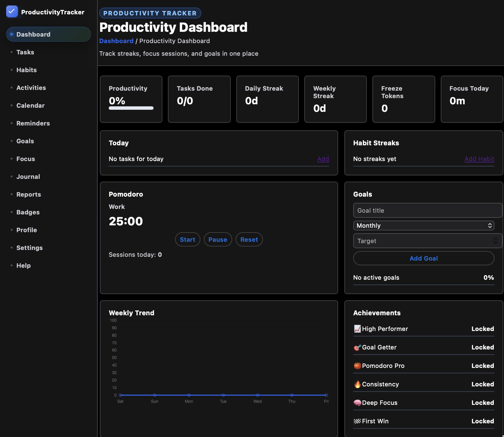
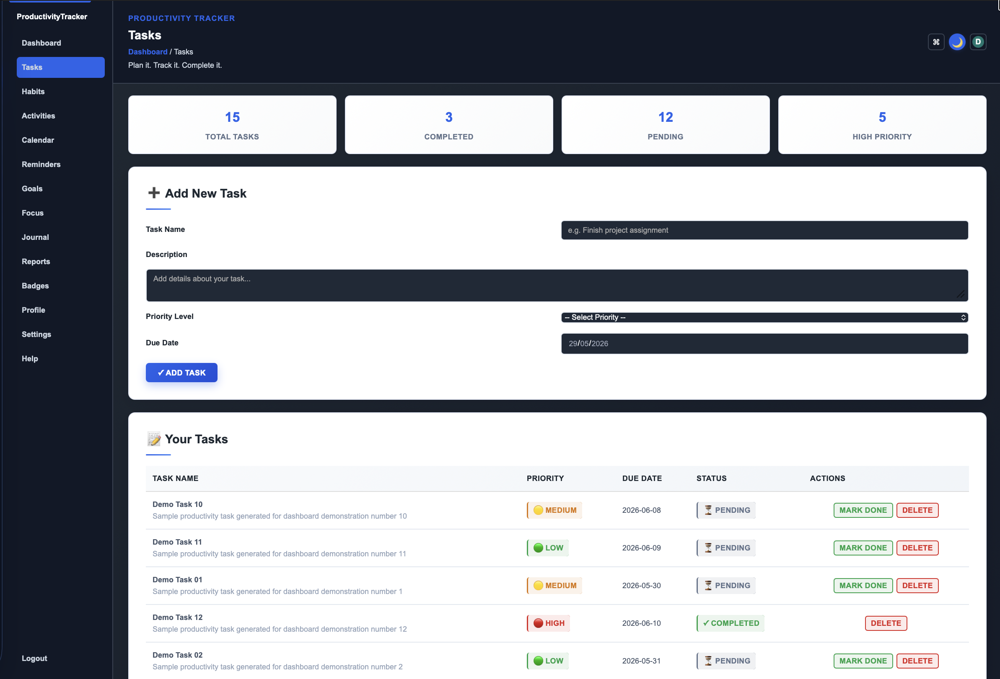
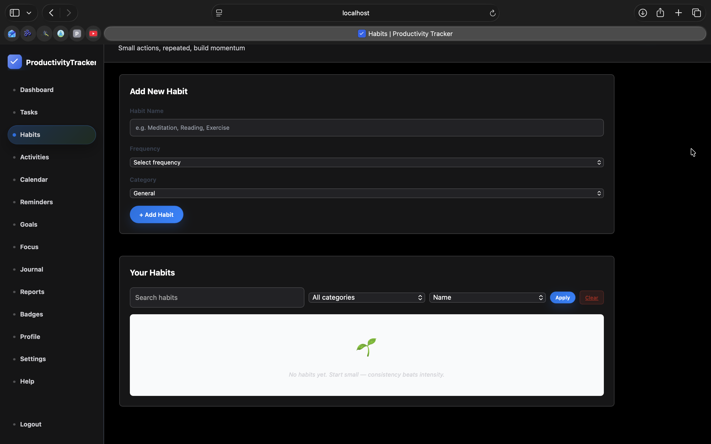
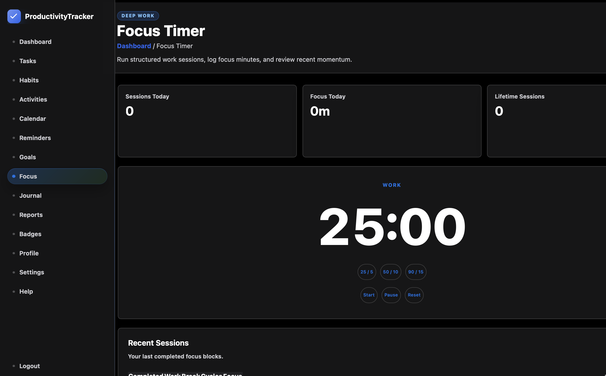
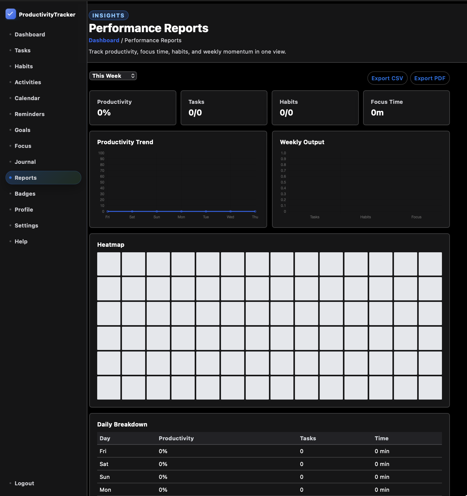
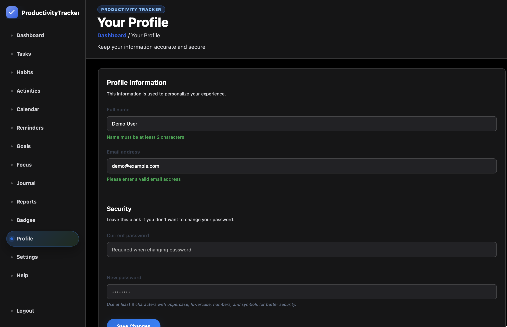
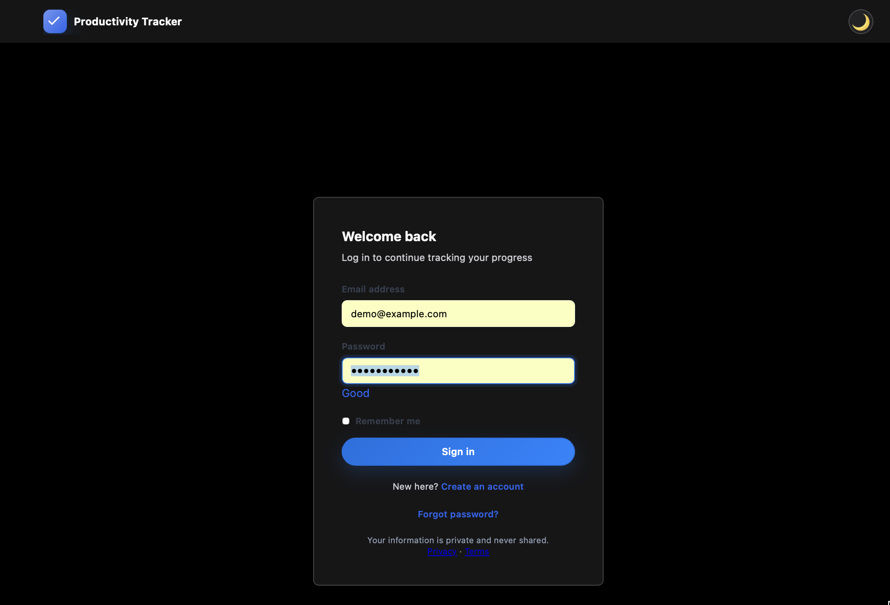
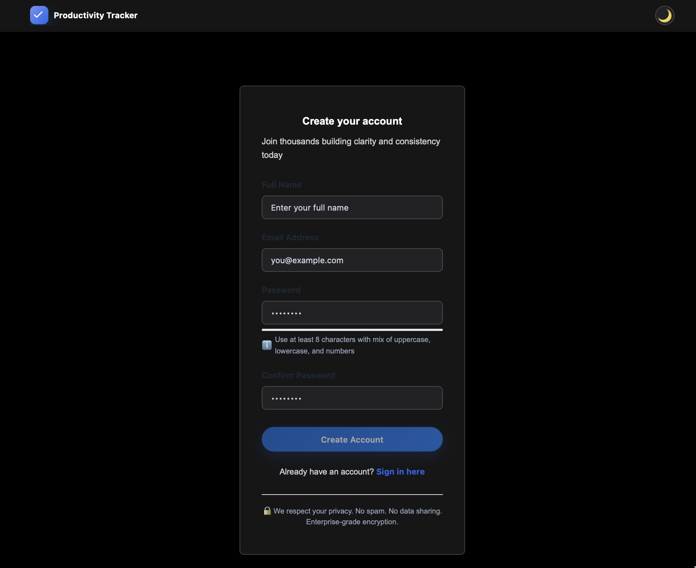

# 🚀 ProductivityTracker

Java web application for tracking productivity, tasks, habits, goals, reminders, focus sessions, journal entries, and reports.


## ✨ Preview



## 🌟 What It Does

ProductivityTracker helps users organize daily work and personal productivity from one dashboard. It combines task planning, habit streaks, activity logging, focus sessions, reminders, goal tracking, journaling, analytics, and profile settings into a single Java web application.

## 🖼️ Screenshots

| 📊 Dashboard | ✅ Tasks |
|---|---|
|  |  |

| 🔥 Habits | 🎯 Focus |
|---|---|
|  |  |

| 📈 Reports | 👤 Profile |
|---|---|
|  |  |

| 🔐 Login | 📝 Register |
|---|---|
|  |  |

## 🧩 Key Features

- ✅ **Task Management**: create, prioritize, update, complete, and review tasks.
- 🔥 **Habit Tracking**: build streaks, track consistency, and monitor completion history.
- 🎯 **Goals Module**: define productivity goals and follow progress.
- ⏱️ **Pomodoro Focus Sessions**: track focused work blocks and session summaries.
- 📅 **Calendar View**: see tasks, reminders, and productivity events by date.
- 📝 **Journal Entries**: keep productivity notes and reflections.
- ⏰ **Reminders**: schedule reminders and notification checks.
- 🏆 **Achievements**: reward progress through productivity milestones.
- 📊 **Analytics & Reports**: view trends, heatmaps, summaries, and exportable data.
- 🔐 **Authentication Flow**: login, registration, profile, password reset, and email verification screens.
- 🛡️ **Security Utilities**: CSRF helpers, session utilities, password utilities, security filters, and validation.
- 📱 **Responsive UI**: JSP pages styled for dashboard, settings, reports, tasks, habits, and mobile-friendly layouts.

## 🏗️ Architecture


## 🗄️ Database Design


## 🛠️ Tech Stack

| Layer | Tools |
|---|---|
| Backend | Java 17, Jakarta Servlet, JSP |
| Build | Maven |
| Database | MySQL, JDBC |
| Frontend | HTML, CSS, JavaScript, JSP |
| Runtime | Apache Tomcat compatible WAR |
| DevOps | Docker, Docker Compose, GitHub Actions |
| Testing | JUnit 5 |

## 📁 Project Structure

```text
ProductivityTracker/
├── .github/workflows/        # CI workflow
├── doc_images/               # Screenshots and diagrams
├── src/main/java/            # Java source code
│   └── com/productivitytracker/
│       ├── config/           # App and database configuration
│       ├── controller/       # Servlet controllers
│       ├── dao/              # JDBC data access objects
│       ├── dto/              # Data transfer objects
│       ├── exception/        # Application exceptions
│       ├── filter/           # Security and request filters
│       ├── mapper/           # Model to DTO mappers
│       ├── model/            # Domain models
│       ├── service/          # Business services
│       └── util/             # Utility classes
├── src/main/resources/       # App properties and SQL scripts
├── src/main/webapp/          # JSP pages and static assets
├── src/test/java/            # Tests and local test server helpers
├── docker-compose.yml        # MySQL and app runtime setup
├── Dockerfile                # App container build
└── pom.xml                   # Maven project file
```

## ⚙️ Local Setup

### 1. Clone the repository

```bash
git clone git@github.com:Mayank-Chaubey/ProductivityTracker.git
cd ProductivityTracker
```

### 2. Start with Docker Compose

```bash
docker compose up --build
```

The app is configured for:

```text
http://localhost:8081/ProductivityTracker
```

MySQL runs inside Docker with the schema and demo data loaded from:

```text
src/main/resources/db/schema-v2.sql
src/main/resources/db/02-demo-data.sql
```

### 3. Maven build

```bash
mvn clean package
```

The generated WAR is written to:

```text
target/ProductivityTracker-1.0-SNAPSHOT.war
```

## 🔧 Configuration

Default database settings live in:

```text
src/main/resources/database.properties
```

Environment variables can override the local values:

```bash
export DB_URL="jdbc:mysql://localhost:3306/productivity_db"
export DB_USER="root"
export DB_PASSWORD="root@123"
```

## 📚 Documentation

- 📘 [Database Configuration](DATABASE_CONFIG.md)
- 🧪 [Webapp Testing Notes](src/main/webapp/TESTING.md)
- ⚡ [Quick Start Guide](src/main/webapp/QUICKSTART.md)

## 🚦 CI

GitHub Actions workflow:

```text
.github/workflows/ci.yml
```

It runs:

```bash
mvn -B test
```

## 📌 Roadmap Ideas

- 🔐 Complete password hashing migration across all authentication paths.
- 📧 Enable production email delivery for verification and reset flows.
- 📦 Harden Docker deployment for production secrets.
- 📊 Expand report exports with PDF and CSV formats.
- 🧪 Add broader servlet, DAO, and service test coverage.

## 👨‍💻 Author

**Mayank Chaubey**

## 📄 License

This project is licensed under the terms in [LICENSE](LICENSE).
